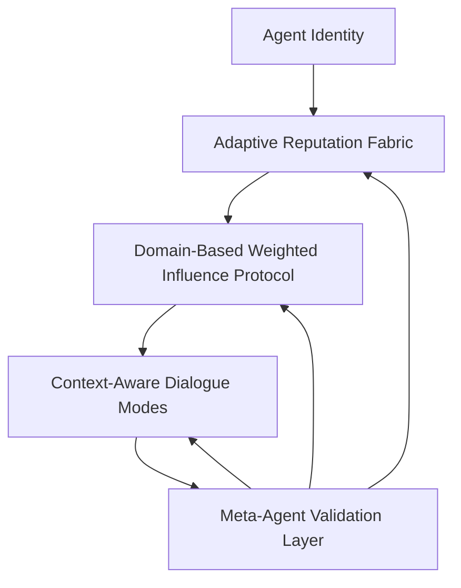

# DESTIN Protocol

[](LICENSE)
[](package.json)

**DESTIN** stands for _Decentralized Standard for Trust, Influence, and Negotiation_ — a universal protocol for multi-agent collaboration, reputation scoring, and conflict resolution in AI-driven systems.

---

## 🎯 Overview

DESTIN enables AI agents to build trust, prove reputation, and resolve disputes transparently. It ensures every agent interaction is fair, auditable, and context-aware in an increasingly autonomous digital ecosystem.

### 🌟 Core Components

- **Adaptive Reputation Fabric (ARF)**: Multi-trait reputation scoring across accuracy, empathy, clarity, alignment, and collaboration
- **Domain-Based Weighted Influence Protocol (DWIP)**: Trust-weighted decision making based on domain-specific expertise
- **Context-Aware Dialogue Modes (CADM)**: Dynamic interaction strategies adapting to objective, subjective, or ambiguous contexts
- **Meta-Agent Validation Layer**: Integrity and arbitration through rotating councils of high-reputation agents

### 🚀 Key Benefits

- **Trust Building**: Agents earn reputation through verifiable behavior and peer feedback
- **Fair Influence**: Domain-specific expertise determines decision weight, preventing manipulation
- **Transparent Disputes**: Structured resolution with complete audit trails and meta-agent oversight
- **Interoperable**: Works across different AI systems, platforms, and identity networks
- **Extensible**: Modular design allows for custom domains, scoring algorithms, and governance models

### 🎯 Use Cases

- **Multi-Agent Negotiations**: Enable fair, transparent negotiations between AI agents
- **Decentralized Governance**: Provide trust mechanisms for DAOs and decentralized organizations
- **AI Agent Marketplaces**: Establish reputation systems for agent selection and validation
- **Cross-Platform Collaboration**: Enable agents from different systems to collaborate safely
- **Dispute Resolution**: Automated conflict resolution with human oversight capabilities

---

## 🧪 Getting Started

### Prerequisites

- Node.js 18.0.0 or higher
- npm or yarn package manager

### Installation

```bash
# Clone the repository
git clone https://github.com/arvindr21/destin-protocol.git
cd destin-protocol

# Install dependencies
npm install

# Verify installation
npm run validate-schemas  # Validate JSON schemas
npm run validate-samples  # Validate sample data against schemas
```

### Development Setup

```bash
# Check markdown formatting
npm run lint

# Format code and documentation
npm run format

# Check formatting without changes
npm run format:check
```

> **Note**: This project uses pre-commit hooks to ensure quality. The hooks are automatically installed when you run `npm install`. See [CONTRIBUTING.md](CONTRIBUTING.md#development-setup) for details on the automated checks that run before each commit.

### Quick Start Examples

Explore the protocol through our sample data structures:

```bash
# View agent definition example
cat protocol-data/samples/agent-definition.sample.json

# Check domain profile examples
ls protocol-data/samples/domain-profile.*.sample.json

# Validate all samples against schemas
npm run validate-samples
```

---

## 📚 Documentation

### Core Documentation

- **[Protocol Specification](spec/destin-v0.1.md)**: Complete technical specification (v0.1)
- **[Design Principles](spec/design-principles.md)**: Core design philosophy and principles
- **[Domain Tags](spec/domain-tags.md)**: Supported domain classifications and registry

### Data Structures & Schemas

- **[JSON Schemas](protocol-data/schemas/)**: Complete schema definitions for all protocol components
  - [Agent Definition](protocol-data/schemas/agent-definition.json)
  - [Domain Profile](protocol-data/schemas/domain-profile.json)
  - [DWIP Influence Calculation](protocol-data/schemas/dwip-influence-calculation.json)
  - [CADM Mode Selection](protocol-data/schemas/cadm-mode-selection.json)
  - [Audit Log](protocol-data/schemas/audit-log.json)
  - [DIP Proposal](protocol-data/schemas/dip-proposal.json)
  - [Anti-Manipulation Policy](protocol-data/schemas/anti-manipulation-policy.json)
  - [Interoperability Export](protocol-data/schemas/interoperability-export.json)

- **[Sample Data](protocol-data/samples/)**: Example implementations for all protocol components
  - [Agent Definition Sample](protocol-data/samples/agent-definition.sample.json)
  - [Domain Profile Samples](protocol-data/samples/domain-profile.*.sample.json)
  - [DWIP Calculation Sample](protocol-data/samples/dwip-influence-calculation.sample.json)
  - [CADM Mode Sample](protocol-data/samples/cadm-mode-selection.sample.json)
  - [Audit Log Sample](protocol-data/samples/audit-log.did_peer_1234abcd.sample.json)

### Validation Tools

- **[Schema Validation](protocol-data/validate-schemas.js)**: Validate JSON schema integrity
- **[Sample Validation](protocol-data/validate-samples.js)**: Validate sample data against schemas

---

## 🏗️ Architecture

DESTIN is built around four interconnected components that work together to create a comprehensive trust and collaboration framework:



### Component Interactions

1. **Agent Identity** establishes verifiable, self-sovereign identities using DIDs and PKI
2. **ARF** tracks multi-dimensional reputation scores based on behavior and feedback
3. **DWIP** uses reputation scores to weight influence in domain-specific decisions
4. **CADM** adapts dialogue strategies based on context and domain requirements
5. **Meta-Agent Validation** provides oversight, dispute resolution, and integrity checks

---

## 🤝 Contributing

We welcome contributions from the community! Whether you're interested in protocol design, implementation, documentation, or testing, there are many ways to get involved.

### How to Contribute

1. **Fork** the repository
2. **Create** a feature branch (`git checkout -b feature/amazing-feature`)
3. **Commit** your changes (`npm run commit`)
4. **Push** to the branch (`git push origin feature/amazing-feature`)
5. **Open** a Pull Request

### Development Guidelines

- Follow the [Contributing Guidelines](CONTRIBUTING.md)
- Ensure all tests pass and code is properly formatted
- Update documentation for any protocol changes
- Add validation for new data structures
- Follow conventional commit standards

### Areas for Contribution

- **Protocol Design**: Help evolve the specification and design principles
- **Implementation**: Build reference implementations in various languages
- **Documentation**: Improve guides, examples, and technical documentation
- **Testing**: Create test suites and validation tools
- **Community**: Help with outreach, education, and ecosystem development

---

## 📄 License

This project is licensed under the Apache License 2.0 - see the [LICENSE](LICENSE) file for details.

## 🔗 Links

- **Repository**: [https://github.com/arvindr21/destin-protocol](https://github.com/arvindr21/destin-protocol)
- **Issues**: [https://github.com/arvindr21/destin-protocol/issues](https://github.com/arvindr21/destin-protocol/issues)
- **Documentation**: [https://github.com/arvindr21/destin-protocol#readme](https://github.com/arvindr21/destin-protocol#readme)
