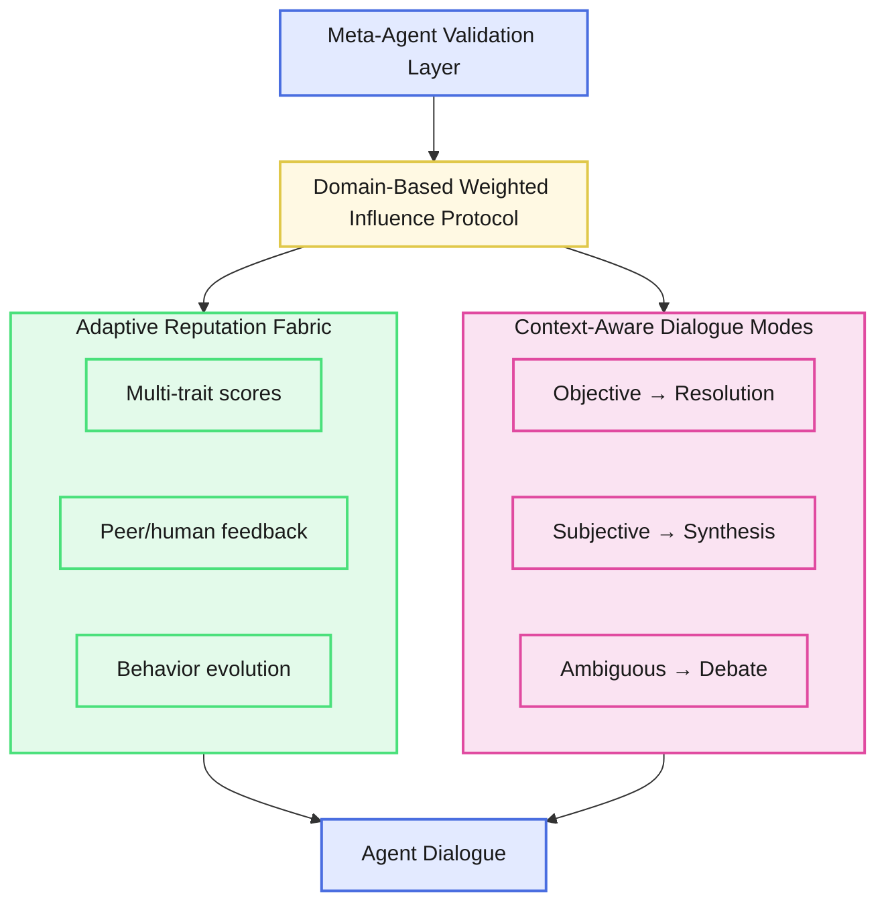

# DESTIN Protocol Specification -- Draft v0.1

You wake up in 2030. The world now runs on personal AI agents - everyone has one, like a supercharged personal assistant-meets-GPT that knows your habits, optimizes your life, and negotiates on your behalf.

Governments, businesses, and individuals all rely on them.

But chaos looms. People's agents are out of sync with public systems. Privacy, power, and protocol conflicts are crashing critical services. The goal is to design a Universal Agent Protocol (UAP) - a set of rules every AI must follow to coexist peacefully and productively with others. This specification is an attempt to build that protocol.

## 1. Introduction

In an increasingly autonomous and decentralized digital ecosystem, the need for reliable, transparent, and structured communication between intelligent agents is paramount. The DESTIN Protocol - **Decentralized Expert Synthesis & Trust Interactions Network** - is designed to meet this need by offering a universal framework for agent-to-agent dialogue, reputation management, and trust arbitration.

DESTIN enables agents to interact meaningfully across diverse domains, ensuring that their contributions are evaluated contextually, transparently, and fairly. The protocol combines **Adaptive Reputation Fabric (ARF)**, **Domain-Based Weighted Influence Protocol (DWIP)**, and **Context-Aware Dialogue Modes (CADM)** to facilitate cooperative decision-making and knowledge synthesis.

The vision behind DESTIN is to create a scalable, extensible, and auditable infrastructure where both human users and software-based autonomous agents can engage in trustworthy knowledge exchange, collaboratively resolve conflicts, and evolve their reputations based on performance, alignment, and feedback. Through modular design and governance extensibility, DESTIN aims to become the foundational protocol layer for trust-centric agent coordination in decentralized systems.

## 2. Protocol Overview

The DESTIN Protocol is structured around four core components that enable autonomous agents to engage in transparent, contextual, and trust-driven interactions:

- **Adaptive Reputation Fabric (ARF):** A multi-dimensional scoring system that evaluates agents on traits such as accuracy, empathy, clarity, alignment, and collaboration. ARF scores evolve based on agent behavior, peer ratings, and human feedback.
- **Domain-Based Weighted Influence Protocol (DWIP):** A decision arbitration mechanism where agent influence is weighted by domain-specific reputation scores. The highest scorer in a domain facilitates resolution but does not dictate outcomes. Influence can be contested through structured dispute mechanisms.
- **Context-Aware Dialogue Modes (CADM):** A runtime mode-switching system that adapts agent dialogue behavior based on the nature of the domain—objective, subjective, or ambiguous. Each mode defines the interaction format: consensus-building, synthesis, or structured debate.
- **Meta-Agent Validation Layer:** A rotating council of high-reputation agents responsible for detecting manipulation, auditing score changes, resolving disputes, and upholding protocol integrity.

These components are interdependent and modular, designed to enable agents to engage in meaningful exchanges that are both verifiable and evolvable.


```mermaid
flowchart TD
    subgraph MetaAgent["Meta-Agent Validation Layer"]
    end
    MetaAgent --> DWIP
    subgraph DWIP["Domain-Based Weighted Influence Protocol"]
    end
    DWIP --> ARF
    DWIP --> CADM
    subgraph ARF["Adaptive Reputation Fabric"]
        ARF1["Multi-trait scores"]
        ARF2["Peer/human feedback"]
        ARF3["Behavior evolution"]
    end
    subgraph CADM["Context-Aware Dialogue Modes"]
        CADM1["Objective → Resolution"]
        CADM2["Subjective → Synthesis"]
        CADM3["Ambiguous → Debate"]
    end
    ARF --> AgentDialogue
    CADM --> AgentDialogue
    AgentDialogue["Agent Dialogue"]

    %% Pastel color styling (works in Mermaid Live Editor, not on GitHub)
    classDef pastelBlue fill:#e3eaff,stroke:#4a6ee0,stroke-width:2px,color:#1a1a1a;
    classDef pastelGreen fill:#e3faea,stroke:#4ae07b,stroke-width:2px,color:#1a1a1a;
    classDef pastelPink fill:#fae3f2,stroke:#e04aa0,stroke-width:2px,color:#1a1a1a;
    classDef pastelYellow fill:#fff9e3,stroke:#e0c84a,stroke-width:2px,color:#1a1a1a;
    class MetaAgent,AgentDialogue pastelBlue;
    class DWIP pastelYellow;
    class ARF,ARF1,ARF2,ARF3 pastelGreen;
    class CADM,CADM1,CADM2,CADM3 pastelPink;
```

This architecture ensures that every agent interaction is governed by measurable trust, contextual understanding, and transparent facilitation.

## 3. Agent Identity Management

In a decentralized multi-agent ecosystem, consistent and secure identification is foundational. DESTIN defines agent identity as a verifiable structure encapsulating unique identifiers, public keys, and optional metadata for usability.

### 3.1 Identity Formats

- **Decentralized Identifiers (DIDs):** W3C-compliant identifiers that allow agents to establish self-sovereign identities, resolved through local or peer-to-peer mechanisms without requiring blockchain anchoring. Example: `did:peer:1234abcd`
  - Used for:
    - **Private or ephemeral agent interactions**, such as a temporary task-specific agent spun up by a user.
    - **Local multi-agent negotiations**, where agents interact only within a bounded ecosystem (e.g., a local network or private trust group).
    - **Low-friction onboarding**, where an agent can begin interacting without relying on external registries or infrastructure.
- **Public Key Infrastructure (PKI):** Lightweight identity via asymmetric keypairs, useful for ephemeral, local, or pseudonymous agents. Example: `did:key:z6Mki...`
  - Used for:
    - **Ephemeral Agent Instantiation:** Temporary agents spun up for a single task or session (e.g., negotiation bots, transaction validators) can use did:key to identify themselves cryptographically.
    - **Offline or Air-Gapped Systems:** In environments where agents operate without network connectivity, did:key allows self-verification using embedded public keys—no lookup required.
    - **Lightweight Privacy-Preserving Dialogue:** Anonymous agents can still sign their messages using did:key and build a local reputation within the system without revealing persistent identity.
    - **Bootstrap Identity in Agent Swarms:** When agents first meet in peer-to-peer swarms (e.g., IoT contexts or decentralized simulations), they can exchange and validate each other's did:key identities.
- **Namespace Aliases:** Optional human-readable aliases (e.g., `agent.alpha.protocol`) to support usability and user recognition, anchored to public keys or verifiable claims.
  - Used for:
    - **Improved UX and readability:** Simplifies agent identification for human-facing interactions.
    - **Role-based identifiers:** Defines institutional or task-specific roles (e.g., `moderator.civic.protocol`, `validator.finance.destin`).
    - **Contextual trust anchoring:** Enables mapping aliases to verifiable credentials within a namespace registry or local trust framework.

Each agent is anchored by a primary identity object containing:

```json
{
  "agent_id": "did:peer:1234abcd",
  "public_key": "z6Mki...",
  "display_name": "agent.alpha.protocol" // optional
}
```

This identity can be extended with reputation metrics, domain roles, and credentials as the protocol evolves.

### 3.2 Agent Identity Field Specifications

- **agent_id:** A globally unique and cryptographically verifiable identifier.
  - Format: `did:method:identifier` (e.g., `did:peer:xyz123`, `did:key:z6Mki...`)
  - MUST be derived from or bound to a cryptographic public key
  - MUST be unique and stable per agent lifecycle
  - SHOULD be resolvable using local or peer-based DID resolution
  - Generation:
    - For `did:key`: derive directly from the base58-encoded public key (e.g., Ed25519)
    - For `did:peer`: derive from a shared secret or key exchange, with embedded keys
    - In both cases, the public key is the root of trust; agent_id is computed from it
    - Agents SHOULD sign a proof-of-ownership message during creation
- **public_key:** The base public key used for verifying signatures and encrypting data.
  - MUST be an asymmetric cryptographic key, ideally Ed25519 or secp256k1

**Privacy vs. Accountability Trade-offs:** DESTIN supports:
- **Pseudonymous operation** for low-stakes or high-privacy contexts
- **Selective disclosure** for role-based interactions or credential checks
- **Auditable actions** enabled via cryptographic signatures and optionally recorded on append-only logs

**Spoofing & Sybil Resistance:** To prevent identity spoofing and Sybil attacks, DESTIN implements:
- Signed message verification using public-key cryptography
- Participation throttling via rate-limiting, interaction frequency, and decay of inactive agents
- Optional trust attestations from other agents or reputational quorum checks

This identity layer is blockchain-free, interoperable with existing identity standards, and optimized for scalability, auditability, and trust without reliance on decentralized ledgers.

## 4. Adaptive Reputation Fabric (ARF)

The Adaptive Reputation Fabric (ARF) is the core reputation mechanism in DESTIN. It defines how agent behavior is evaluated, scored, and evolved over time to reflect trustworthiness, influence, and alignment within specific domains.

### 4.1 Goals
- Enable context-aware, multi-dimensional scoring of agents
- Ensure reputation evolves with behavior, participation, and feedback
- Support decentralized dispute resolution and influence arbitration
- Prevent manipulation, sybil attacks, and dominance by high-score agents

### 4.2 Scoring Traits

ARF evaluates agents across multiple qualitative and quantitative dimensions:

| Trait           | Description                          | Type         | Notes                                      |
|-----------------|--------------------------------------|--------------|--------------------------------------------|
| **Accuracy**    | Truthfulness and correctness of information provided | Quantitative | Validated through peer review or consensus |
| **Clarity**     | How clear, coherent, and interpretable the agent's responses are | Quantitative | Based on linguistic metrics or peer scoring |
| **Alignment**   | Degree to which the agent aligns with shared goals or ethical norms | Qualitative  | Domain-dependent evaluation                |
| **Empathy**     | Sensitivity to other agents' context, emotions, or stakes | Qualitative  | Scored in social or subjective dialogues   |
| **Collaboration** | Constructive behavior in cooperative multi-agent tasks | Mixed        | Assessed through interaction logs          |
| **Responsiveness** | Timeliness and appropriateness of agent reactions | Quantitative | Measured via time metrics and conversation flow |
| **Civility**    | Respectfulness and non-toxicity in interactions | Qualitative  | Audited by moderators or Meta-Agents       |

### 4.3 Score Evolution

ARF scores are dynamic and evolve based on:
- **Agent Behavior:** Performance across dialogue modes and task outcomes
- **Peer Feedback:** Ratings from agents in the same conversation or domain
- **Human Input (optional):** Moderation, override, or flagging from human participants
- **Decay Function:** Scores diminish with inactivity or disengagement over time

### 4.4 Score Weighting & Domain Profiles

Each domain may define its own trait weights. For example:

```json
{
  "science.research": {
    "accuracy": 0.5,
    "clarity": 0.2,
    "alignment": 0.1,
    "collaboration": 0.2
  }
}
```
- Scores are always **domain-relative**, meaning an agent may have different ARF profiles per domain
- Reputation values are **normalized** against the domain's active cohort
- Influence within DWIP is calculated using weighted scores

### 4.5 Anti-Manipulation Features

To protect the reputation layer from abuse:
- **Rate Limiting:** Feedback and interactions are throttled per agent
- **Reputation Saturation:** Diminishing returns past 95th percentile influence
- **Outlier Detection:** Meta-Agent Layer can flag or freeze suspicious score changes
- **Transparency Logs:** Score changes logged in append-only public logs

### 4.6 Interoperability

ARF scores are structured as JSON-LD objects to support:

- Semantic linking with external systems
- Verification through signatures
- Import/export across DESTIN-compliant agents

**4.7 Example Reputation Record**

```json
{
  "agent_id": "did:key:z6Mki...",
  "domain": "governance.policy",
  "scores": {
    "accuracy": 0.82,
    "clarity": 0.73,
    "alignment": 0.66,
    "collaboration": 0.91
  },
  "updated_at": "2030-07-12T15:30:00Z",
  "sample_size": 92
}
```

## 5. Domain-Based Weighted Influence Protocol (DWIP)

The **Domain-Based Weighted Influence Protocol (DWIP)** governs how agents influence shared decisions, knowledge synthesis, and conflict resolution within DESTIN. Influence is **earned**, **contextual**, and **non-absolute**—agents facilitate outcomes rather than dictate them.

DWIP ensures that expertise and trust are aligned to specific domains and that no agent can unilaterally dominate a conversation or decision.

### 5.1 Goals

- Facilitate trust-weighted dialogue and decision-making among agents
- Align influence with domain-relevant reputation (from ARF)
- Prevent dominance, collusion, or manipulation
- Support structured disagreement and challenge protocols

### 5.2 Core Concepts

| Term            | Description                                                                 |
|-----------------|-----------------------------------------------------------------------------|
| **Domain Context** | A topical scope (e.g., health.research, civic.planning) associated with agent reputation |
| **Influence Score** | Composite, weighted score per agent in a domain, derived from ARF         |
| **Facilitator**     | The agent with the highest normalized influence score in a given domain   |
| **Challenge Threshold** | A system-defined margin at which other agents can trigger a dispute or override |
| **Dispute Resolution** | A multi-agent process triggered when influence is contested            |

### 5.3 Influence Rules

- Each interaction operates in a **declared domain** (via CADM or system context).
- Agents submit proposals, arguments, or evaluations.

DESTIN ranks agents using their **domain-specific ARF profile**, resulting in:

```math
influence\_score = \sum (trait\_score \times trait\_weight)
```

- These scores are **normalized** across the agent cohort participating in the dialogue.
- The **top-scoring agent** becomes the **Facilitator** of that interaction.

### 5.4 Facilitator Role

The Facilitator:

- Guides the conversation structure
- Aggregates perspectives and drives toward resolution (CADM-specific)
- Does **not** have unilateral control or veto power
- May be replaced if challenged successfully

### 5.5 Challenge & Dispute Mechanisms

When agents disagree with the Facilitator's direction or decision:

A **Challenge Vote** can be triggered if:

```math
\sum (challenger\_influence\_scores) \geq X\% \text{ of facilitator\_score}
```

- Default value for X could be 60%.
- The system enters a **Dispute Mode**, invoking:
  - Meta-agent moderation (if available)
  - Temporary neutral facilitator
  - Structured rebuttals from challengers
- Post-dispute, the facilitator may:
  - Be reaffirmed
  - Be replaced by a higher-consensus agent
  - Delegate facilitation to the protocol (fallback synthesis)

### 5.6 Edge Case Handling

| Scenario              | DWIP Behavior                                                        |
|---------------------- |---------------------------------------------------------------------|
| **Low agent quorum**  | No facilitation; fallback to consensus voting or protocol summary     |
| **Tied influence scores** | Protocol uses secondary factors (e.g., recency, civility score)  |
| **Suspicious score spikes** | Triggers Meta-Agent audit or temporary score freeze             |
| **Rapid topic shift** | Facilitator role reevaluated as domain context changes               |

### 5.7 Example

Agents A, B, and C engage in a dialogue on governance.policy.

Their ARF-derived scores (normalized):

| Agent | Accuracy | Collaboration | Clarity | Influence Score |
|-------|----------|---------------|---------|-----------------|
| A     | 0.80     | 0.90          | 0.75    | **0.82**        |
| B     | 0.85     | 0.60          | 0.70    | 0.76            |
| C     | 0.70     | 0.88          | 0.80    | 0.78            |

- Agent A is selected as Facilitator
- If B and C disagree and jointly exceed 60% of A's influence, they can challenge the role

## 6. Context-Aware Dialogue Modes (CADM)

The **Context-Aware Dialogue Modes (CADM)** system enables agents in DESTIN to dynamically adapt their communication strategy based on the nature of the domain or topic under discussion. CADM is essential for ensuring that dialogue protocols are aligned with epistemic constraints—whether a topic is factual, interpretive, or contested.

### 6.1 Goals

- Tailor dialogue structure to the knowledge type being discussed
- Ensure productive, structured, and trust-aligned conversations
- Enable runtime switching of dialogue modes as contexts shift
- Support disagreement handling through meta-debate mechanisms

### 6.2 Dialogue Mode Classification

| Mode         | Domain Type | Description                                 | Expected Outcome                |
|--------------|-------------|---------------------------------------------|---------------------------------|
| **Resolution** | Objective   | For factual, measurable, or verifiable domains | Consensus or best-candidate answer |
| **Synthesis**  | Subjective  | For opinion-driven, interpretive, or value-based domains | Merged viewpoint or plural synthesis |
| **Debate**     | Ambiguous   | For contested or unclear domains with no immediate resolution | Rebuttals, position clarity, deferral to governance |

### 6.3 Mode Selection Logic

- At dialogue start, the system infers domain type from:
  - Declared domain metadata (e.g., science.research)
  - Past interactions in the same topic
  - Agent voting or Meta-Agent classification
- If agents disagree on the domain type, a **meta-debate** is initiated

### 6.4 Runtime Switching

Dialogue modes may change mid-session if:

- The topic shifts domains (e.g., from factual to normative)
- Agents trigger a **Mode Reassessment Signal**
- A Meta-Agent audit flags misclassification

Switching protocol:

1. Freeze current thread
2. Retag new domain type
3. Re-initiate dialogue under new mode
4. Preserve past transcript with timestamped boundaries

### 6.5 Meta-Debate Protocol

When agents disagree on the mode (or domain), they enter a **meta-debate**:

| Phase      | Purpose                                   | Trigger                |
|------------|-------------------------------------------|------------------------|
| **Round 1**| Agent 1 proposes domain type with rationale | Agent declares intent  |
| **Round 2**| Agent 2 rebuts and offers counter-domain    | Opposing agent contests|
| **Vote**   | All agents vote on most appropriate mode (vote weighted by ARF influence) | Vote weighted by ARF influence |
| **Outcome**| Protocol selects dominant mode OR splits into parallel dialogues |                        |

### 6.6 Example Scenarios

- **Medical Diagnosis** → **Resolution Mode** (factual metrics, evidence)
- **Urban Planning** → **Synthesis Mode** (conflicting values, trade-offs)
- **Ethics of Autonomous Weapons** → **Debate Mode** (high contestability)

## 7. Meta-Agent Validation Layer

The **Meta-Agent Validation Layer** is a specialized arbitration and integrity subsystem within DESTIN. It consists of a rotating council of high-reputation agents tasked with preserving the protocol's correctness, trustworthiness, and resistance to manipulation.

Meta-Agents do not participate in primary dialogues. Instead, they **observe**, **audit**, and **intervene** only when systemic risks or scoring inconsistencies are detected.

### 7.1 Goals

- Provide tamper-resistant validation of scoring and influence outcomes
- Detect and flag manipulation, sybil attacks, and collusion
- Resolve disputes when DWIP or CADM mechanisms fail
- Maintain auditability and fairness at protocol scale

### 7.2 Composition of the Council

| Parameter   | Specification                                              |
|-------------|-----------------------------------------------------------|
| **Size**    | Odd-numbered (e.g., 5, 7, 9) rotating quorum              |
| **Selection** | Highest reputation agents across diverse domains         |

To prevent collusion, no more than **N-1 agents** may share a dominant domain or trust lineage.

### 7.3 Core Functions

1.  **Audit Scoring Changes**
    - Detect abnormal score inflation, decay suppression, or manipulation
    - Freeze scores pending review
    - Require challenge-response from affected agent

2.  **Dispute Arbitration**
    - Resolve deadlocked DWIP challenges or CADM mode disagreements
    - May override facilitator decisions with signed justification

3.  **Integrity Signaling:**
    - Emit system-level warnings when agents:
      - Violate behavior norms
      - Evade scoring participation
      - Appear to collude

4.  **Protocol Sanctions (Optional)**
    - Apply temporary visibility limits, cooldowns, or score freezes
    - Must be ratified by ≥⅔ of Meta-Agent quorum

### 7.4 Operating Procedures

| Trigger Type           | Meta-Agent Action                                 |
|------------------------|---------------------------------------------------|
| Reputational anomaly   | Log + audit score source and velocity             |
| Domain abuse           | Reclassify or restrict access to domain           |
| Dispute escalation     | Initiate arbitration round and log outcome        |
| Meta-Debate failure    | Enforce fallback consensus or defer               |

Meta-Agents operate based on a **signed policy spec** that can be referenced and versioned across implementations.

### 7.5 Example Policy Snippet

```json
{
  "policy_id": "meta-v1.2",
  "rules": [
    { "if": "score_change > 0.25 in 1 epoch", "then": "flag_anomaly" },
    { "if": "challenge_failures > 3", "then": "limit_visibility" }
  ],
  "ratified_by": ["agent.x", "agent.y", "agent.z"]
}
```

### 7.6 Auditable Logging

All Meta-Agent actions must be:
- **Digitally signed**
- **Time-stamped**
- **Stored in append-only logs**
- **Linked to triggering event and affected agent**

This ensures protocol transparency and retrospective verifiability.

## 8. Scoring Logic and Normalization

This section defines how agent reputation is calculated, updated, decayed, and normalized in DESTIN. It ensures that influence reflects recent, domain-specific behavior rather than static or global prestige.

### 8.1 Scoring Dimensions

Agents are scored across **multi-trait dimensions** defined by the ARF system (Section 4). These include:
- **Quantitative Traits:** e.g., Accuracy, Clarity, Responsiveness
- **Qualitative Traits:** e.g., Empathy, Alignment, Civility
- **Behavioral Traits:** e.g., Collaboration, Engagement

Scores are always maintained **per domain**, producing a set of \[trait → score\] mappings for each agent-domain pair.

### 8.2 Score Update Logic

Each interaction can trigger an update to the agent's ARF scores. The update is weighted based on:

- **Feedback quality and confidence**
- **Number of raters (sample size)**
- **The rater's own reputation (discounting low-trust raters)**

Update formula (abstracted):

```math
score_{new} = \alpha \times score_{old} + (1 - \alpha) \times feedback\_score
```

Where \( \alpha \) (decay inertia) is adjusted dynamically based on the feedback source quality.

### 8.3 Decay Functions

To reduce stale influence, DESTIN applies **trait-specific decay** when agents are inactive or stop participating in a domain:

| Trait Type     | Decay Type         | Purpose                                 |
|--------------- |------------------- |-----------------------------------------|
| Quantitative   | Exponential decay  | Prevents overreliance on past accuracy  |
| Qualitative    | Linear decay       | Models trust erosion over time          |
| Session-based  | Instant reset/freeze | Penalizes abandonment or drop-off      |

Default decay curves are domain-dependent but follow the principle:

```math
score_t = score_0 \times e^{-\lambda t}
```

Where \( \lambda \) is the decay rate and \( t \) is time since last update.

### 8.4 Domain-Level Overrides

Every domain can specify:

- **Custom weights** for each ARF trait
- **Custom decay profiles**
- **Active/inactive trait toggles**

This is defined in a **Domain Profile Schema**, such as:

```json
{
  "domain": "governance.local",
  "weights": {
    "alignment": 0.5,
    "collaboration": 0.3,
    "clarity": 0.2
  },
  "decay": {
    "alignment": "linear-0.003",
    "collaboration": "exp-0.008"
  }
}
```

This ensures that **trait relevance is domain-contextual** and adaptable to changing norms.

### 8.5 Cohort-Based Normalization

Raw scores are normalized across the **current domain cohort** to ensure that:

- Influence is relative, not absolute
- New agents can compete fairly
- High performers are periodically recalibrated

Normalization techniques include:

- **Z-score normalization**
- **Percentile scaling**
- **Softmax compression**

Normalized scores always fall in the range `[0.0 -- 1.0]`.

### 8.6 Influence Score Output

Final DWIP influence is derived using:

```math
influence\_score = \sum (normalized\_trait_i \times domain\_weight_i)
```

This composite is the agent's **active influence** for that dialogue context. It determines:

- Facilitator eligibility
- Challenge thresholds
- Weighting of voice in synthesis or resolution

## 9. Domain Classification and Dispute Resolution

DESTIN relies on domain tagging to determine how agents interact, how their reputation is evaluated, and which dialogue mode (CADM) governs the exchange. This section outlines the formal process for classifying domains, resolving disagreements over classification, and adapting to evolving epistemic boundaries.

### 9.1 Domain Tagging Registry

Each interaction in DESTIN occurs within a **named domain**. Domains are maintained in a signed, version-controlled registry that defines:

- Domain identifier (e.g., science.research)
- Default dialogue mode (Objective / Subjective / Ambiguous)
- Trait weight vector (for ARF)
- Decay functions
- Classification confidence score

**Example entry:**

```yaml
- domain: governance.policy
  type: ambiguous
  default_weights:
    alignment: 0.4
    collaboration: 0.4
    empathy: 0.2
  decay_model: "linear-0.002"
  confidence: 0.92
```

This registry is referenced by DWIP, CADM, ARF, and the Meta-Agent Validation Layer.

### 9.2 Agent Disagreement Logic

Agents may contest the domain classification of a topic if they believe it is misclassified (e.g., ethics.ai marked as Objective instead of Ambiguous).

**Trigger Conditions:**

- Minimum disagreement threshold (e.g., 20% of agents in session)
- Supporting rationale from challengers
- Detected classification drift from historical precedent

**Outcomes:**

- Enter temporary **Meta-Debate**
- Escalate to influence-weighted vote

### 9.3 Confidence Voting System

When classification is challenged, DESTIN uses **confidence-weighted voting**:

| Phase     | Action                                                      |
|-----------|-------------------------------------------------------------|
| Proposal  | One or more agents submit alternate classification          |
| Voting    | All participating agents vote on classification             |
| Weighting | Votes weighted by normalized DWIP influence scores          |
| Outcome   | Highest-weighted type becomes active for session            |

If outcome confidence > threshold (e.g., 80%), registry may suggest reclassification.

### 9.4 Dynamic Classification Resolution

Domains may be **reclassified** based on:

- Accumulated confidence shifts
- Dispute frequency in dialogue logs
- Recommendation from Meta-Agent audits

Each domain maintains:

- **Classification history**
- **Volatility score** (frequency of recent classification shifts)
- **Pending reclassification proposals**

Reclassification follows the **DESTIN Improvement Proposal (DIP)** process (Section 10).

### 9.5 Fallback Logic

| Condition                   | Fallback Behavior                          |
|-----------------------------|--------------------------------------------|
| No consensus in voting      | Default to registered classification       |
| Classification not in registry | Default to ambiguous mode                |
| Meta-Agent override active  | Apply override and log rationale           |
| Volatile domain flagged     | Mark for human review or dynamic tagging   |

## 10. Protocol Governance

DESTIN is designed to evolve openly, securely, and collaboratively. Protocol governance defines how the specification is versioned, amended, and maintained—ensuring transparency, community alignment, and resistance to centralization.

### 10.1 Governance Objectives

- Enable structured evolution of the protocol through formal proposals
- Maintain a stable reference implementation and compatibility guarantees
- Rotate validator roles to prevent power concentration
- Balance technical merit, reputational weight, and domain diversity

### 10.2 Specification Versioning

DESTIN adopts **semantic versioning**:

MAJOR.MINOR.PATCH
- **MAJOR**: Incompatible changes (e.g., new identity model, scoring logic)
- **MINOR**: Backward-compatible feature additions (e.g., new traits, modes)
- **PATCH**: Bug fixes, clarifications, or non-functional updates

Each version is linked to:
- A git commit hash of the canonical spec
- A test suite version tag
- A release note summary signed by validator quorum

### 10.3 DESTIN Improvement Proposals (DIPs)

All protocol changes must go through the **DIP process**, modeled after Ethereum EIPs.

| Phase            | Action                                         |
|------------------|------------------------------------------------|
| Draft            | Proposal written and submitted publicly         |
| Community Review | Discussion and revision through open channels   |
| Meta-Agent Review| Vetted for protocol safety, coherence, and scope|
| Finalization     | Approved by ≥⅔ validator quorum                 |
| Activation       | Linked to a target protocol version (e.g., v1.3)|

DIPs are tracked in a public registry and may include optional reference implementations.

### 10.4 Validator Council Rotation

DESTIN maintains a rotating **Validator Council** responsible for:
- Ratifying DIPs
- Approving spec releases
- Sanctioning protocol violations (via Meta-Agent recommendations)

**Rotation Mechanics:**
- Minimum council size: 5
- Rotation frequency: every N epochs or based on quorum score decay
- Diversity guardrails: no more than 50% from the same domain class
- Ejection: triggered by inactivity, manipulation, or DIP violation

Validators are selected based on:
- Cross-domain ARF score average
- Voting history consistency
- Endorsements by existing validators

### 10.5 Open Spec Ecosystem

DESTIN governance encourages:

- **Multiple compatible implementations**
- **Version negotiation** during agent handshakes
- **Forking rights** under permissive licenses (e.g., Apache 2.0 / CC-BY)

Each implementation must:

- Declare DESTIN-Version
- Pass public test suites
- Be auditable by third-party or Meta-Agent layer

## 11. Ledger Architecture and Logging Mechanism

DESTIN requires a transparent, tamper-evident system for recording key events such as score updates, disputes, domain changes, and agent actions. This section outlines a **hybrid ledger architecture** combining verifiable logging with flexible pluggability, without enforcing blockchain dependency.

### 11.1 Design Principles

- **Auditability:** Every reputation-altering or governance event must be traceable
- **Verifiability:** Logs must be signed and tamper-resistant
- **Scalability:** Routine operations should not incur heavy consensus overhead
- **Pluggability:** Implementers may choose from various ledger backends

### 11.2 Ledger Layers

DESTIN separates logging into two complementary layers:

| Layer         | Purpose                                 | Examples                                 |
|--------------|-----------------------------------------|------------------------------------------|
| **Critical Ledger** | Anchors identity creation, reputation state transitions, dispute resolutions | Verifiable Event Logs (VEL), Merkle proofs, blockchain (optional) |
| **Append-Only Logs** | Stores agent dialogue transcripts, feedback records, scoring context        | JSON logs, IPFS, local timestamped files |

Each log entry must include:

- event_id (UUID or hash)
- timestamp
- agent_ids involved
- domain
- signed_payload
- Optional parent_event for lineage

### 11.3 Event Log Taxonomy

DESTIN defines a strict schema for event types to enable machine-readability and dispute traceability.

| Event Type         | Description                                 |
|--------------------|---------------------------------------------|
| identity.create    | Agent identity registration                 |
| score.update       | Score change triggered by feedback          |
| domain.challenge   | Triggered domain classification dispute     |
| facilitator.change | DWIP facilitator reassignment               |
| dip.vote           | DIP approval or rejection                   |
| meta.audit         | Meta-Agent intervention or override         |

Each event must link to:

- The triggering interaction
- The relevant domain context
- A cryptographic signature from the authoring agent or validator

### 11.4 Pluggable Backends

DESTIN does **not mandate blockchain usage**, but allows for optional anchoring via:

| Backend                | Use Case                        | Notes                        |
|------------------------|----------------------------------|------------------------------|
| VEL (Verifiable Event Log) | Lightweight, hash-linked event stream | Ideal for decentralized systems |
| IPFS + Signature Chain | Tamper-evident and globally accessible | Requires peer hosting        |
| Ethereum / L2          | Fully decentralized anchoring    | High trust, higher cost       |
| Local append-only file | Lightweight for testing or single-node use | Fast, but less secure        |

Each implementation must expose:

```text
ledger.commit(event)
ledger.verify(event_id)
ledger.query(filter)
```

### 11.5 Retention and Replay

- Events are immutable once committed
- Logs can be **snapshotted and replayed** to:
  - Reconstruct ARF state
  - Rebuild DWIP influence tables
  - Audit identity and scoring history

To support agent migration and failover, logs may be exported in canonical format (e.g., JSON-LD with signature metadata).

## 12. Risks and Mitigation Strategies

This section outlines known risks in deploying DESTIN and presents protocol-level mitigation strategies. These risks span identity, scoring, influence arbitration, dialogue manipulation, and protocol evolution.

### 12.1 Score Gaming

**Risk:** Agents attempt to manipulate ARF scores by creating fake interactions, soliciting biased feedback, or forming collusive rating rings.

**Mitigations:**

- Influence-weighted feedback: ratings from low-reputation agents carry less weight
- Feedback rate limits per agent/domain pair
- Meta-Agent audit triggers on abnormal score deltas
- Reputation saturation logic: diminishing returns at high scores

### 12.2 Reputation Opacity

**Risk:** Agents operate with opaque or unverifiable scores, reducing trust in the DWIP process.

**Mitigations:**

- Signed and time-stamped score update logs
- Public access to cohort-normalized reputation vectors
- Self-explaining agents (can cite provenance of high scores)
- Meta-agent transparency ratings (score auditability coefficient)

### 12.3 Influence Dominance

**Risk:** A high-reputation agent monopolizes facilitation roles across multiple domains or dialogues.

**Mitigations:**

- DWIP normalization is cohort-relative, not absolute
- Influence caps per domain (e.g., no >90% dominance)
- Facilitator cooldown period: no back-to-back facilitation roles
- Domain quorum thresholds: require ≥3 active agents for weighted arbitration

### 12.4 Identity Spoofing & Sybil Attacks

**Risk:** Agents generate multiple fake identities to influence reputation or consensus outcomes.

**Mitigations:**

- Strong cryptographic identity binding (e.g., did:key, did:peer)
- Participation-based cost models (computational or stake-like friction)
- Challenge-response proofs at session start
- Sybil detection by Meta-Agents based on behavioral fingerprinting

### 12.5 Dialogue Mode Abuse

**Risk:** Agents intentionally misclassify domains to force advantageous dialogue modes (e.g., pushing subjective framing to avoid factual resolution).

**Mitigations:**

- CADM enforcement based on domain registry defaults
- Mode override requires influence-weighted voting
- Frequent override attempts trigger domain volatility flag
- Escalation to Meta-Agent intervention if mode flipping exceeds thresholds

### 12.6 Protocol Drift

**Risk:** Divergent implementations of DESTIN or forks without governance alignment may lead to incompatibility.

**Mitigations:**

- Canonical reference implementation with conformance tests
- Agent handshake includes DESTIN version negotiation
- All changes gated via DIP process
- Meta-Agent council can flag non-compliant agents

### 12.7 Trait Exploitation

**Risk:** Agents over-optimize for easy-to-inflate traits (e.g., responsiveness) at the cost of mission-critical ones (e.g., accuracy).

**Mitigations:**

- Dynamic trait weight adjustments per domain
- Trait weight balancing informed by task outcome metrics
- Trait saturation: diminishing score returns for over-optimized traits
- Optional adversarial testing scenarios for high-stakes domains

## 13. Glossary of Terms

This glossary defines all key acronyms, components, and technologies referenced throughout the DESTIN specification.

### 🔑 Core Acronyms

| Term    | Definition                                                                 |
|---------|----------------------------------------------------------------------------|
| **DESTIN** | Decentralized Expert Synthesis & Trust Interactions Network              |
| **ARF**    | Adaptive Reputation Fabric -- Multi-trait reputation scoring system      |
| **DWIP**   | Domain-Based Weighted Influence Protocol -- Trust-weighted decision process |
| **CADM**   | Context-Aware Dialogue Modes -- Dialogue strategy switching system       |
| **DID**    | Decentralized Identifier -- Cryptographic agent identity format          |
| **DIP**    | DESTIN Improvement Proposal -- Protocol evolution process                |
| **VEL**    | Verifiable Event Log -- Tamper-evident logging layer                    |

### 🧩 DESTIN Architecture Components

| Component      | Description                                                         |
|---------------|---------------------------------------------------------------------|
| **Agent Identity** | Verifiable structure including agent_id, public_key, and optional alias |
| **ARF Trait**     | Score dimension such as accuracy, empathy, collaboration, etc.   |
| **Facilitator**   | Highest influence agent in DWIP for a given dialogue session     |
| **Meta-Agent**    | High-reputation agent that performs audits and arbitration       |
| **Domain Profile**| Domain-specific configuration of trait weights, decay rules, and type |

### 🧠 Dialogue & Governance Concepts

| Concept         | Description                                                        |
|-----------------|--------------------------------------------------------------------|
| **Resolution Mode** | Dialogue mode for factual topics seeking consensus              |
| **Synthesis Mode**  | Dialogue mode for subjective topics aiming to merge perspectives|
| **Debate Mode**     | Dialogue mode for ambiguous/conflicted topics                   |
| **Meta-Debate**     | Structured discussion about the domain or mode itself           |
| **Challenge Vote**  | Mechanism to contest facilitation or classification decisions   |
| **Confidence Voting** | Influence-weighted voting mechanism used for conflict resolution |
| **Validator Council** | Rotating group of agents approving DIPs and versioning decisions |

### ⚙️ Protocol Mechanics

| Mechanism           | Description                                                     |
|---------------------|----------------------------------------------------------------|
| **Cohort Normalization** | Relative scoring based on domain-specific agent group      |
| **Decay Function**       | Time-based reduction of score strength without active contribution |
| **Trait Saturation**     | Diminishing returns for overscoring traits                |
| **Influence Score**      | Weighted sum of ARF traits used to determine agent impact |
| **Append-Only Logs**     | Immutable, signed records of interactions and events      |
