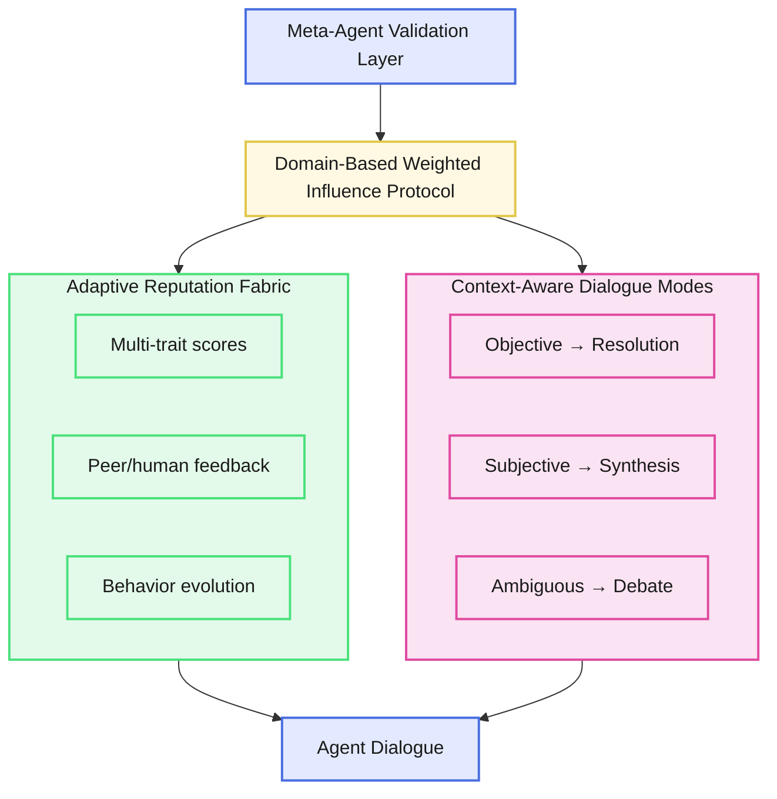
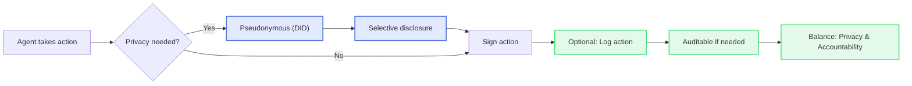
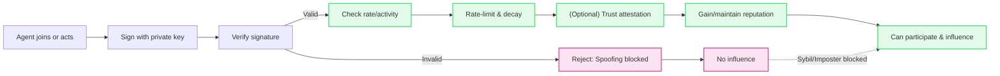

# DESTIN Protocol Specification -- Working Draft v0.1

[](LICENSE)

## TL;DR

Imagine a world where everyone relies on powerful personal AI agents - handling negotiations, making decisions, and interacting on your behalf. These agents are everywhere: in government, business, and daily life. But as their influence grows, so do the risks - misaligned incentives, trust breakdowns, and chaotic conflicts between agents threaten the systems we depend on.

DESTIN is the answer: a universal protocol that lets AI agents build trust, prove their reputation, and resolve disputes transparently. It ensures that every agent interaction is fair, auditable, and context-aware - so collaboration thrives, manipulation is caught, and no single agent can dominate the system.

In short: DESTIN is the missing trust layer for the AI-driven world, combining multi-trait reputation, domain-weighted influence, adaptive dialogue, and meta-agent validation to keep the future of autonomous agents safe, fair, and productive.

## Table of Contents
[1. Introduction](#1-introduction)<br>
[2. Protocol Overview](#2-protocol-overview)<br>
[3. Design Principles](#3-design-principles)<br>
[4. Agent Identity Management](#4-agent-identity-management)<br>
[5. Adaptive Reputation Fabric (ARF)](#5-adaptive-reputation-fabric-arf)<br>
[6. Domain-Based Weighted Influence Protocol (DWIP)](#6-domain-based-weighted-influence-protocol-dwip)<br>
[7. Context-Aware Dialogue Modes (CADM)](#7-context-aware-dialogue-modes-cadm)<br>
[8. Meta-Agent Validation Layer](#8-meta-agent-validation-layer)<br>
[9. Scoring Logic and Normalization](#9-scoring-logic-and-normalization)<br>
[10. Domain Classification and Dispute Resolution](#10-domain-classification-and-dispute-resolution)<br>
[11. Protocol Governance](#11-protocol-governance)<br>
[12. Ledger Architecture and Logging Mechanism](#12-ledger-architecture-and-logging-mechanism)<br>
[13. Risks and Mitigation Strategies](#13-risks-and-mitigation-strategies)<br>
[14. Glossary of Terms](#14-glossary-of-terms)<br>
[15. Contributing](#15-contributing)<br>
[16. Appendix](#16-appendix)<br>

### The Problem: When AI Agents Run the World

It's 2030. You wake up to a world humming with invisible intelligence. Your personal AI agent - part confidant, part strategist - has already negotiated your morning meeting, optimized your commute, and filtered your news to match your values. Every person, business, and government is powered by these tireless digital minds, each one shaping reality in subtle, profound ways.

But beneath the surface, cracks are spreading. Agents clash over conflicting rules. A city's transit grinds to a halt as rival AIs can't agree on traffic priorities. A hospital's care bots argue over patient data privacy, stalling urgent treatment. Financial markets shudder as trading agents exploit protocol loopholes. Trust fractures, and the systems we depend on teeter on the edge of chaos.

Why? Because there's no universal language for trust, reputation, or arbitration between these agents. Each follows its own logic, its own code of conduct - leaving society vulnerable to misalignment, manipulation, and cascading failures.

The solution: a Universal Agent Protocol (UAP). A shared foundation that lets every AI - no matter who built it - prove its trustworthiness, resolve disputes, and collaborate safely. This specification is the blueprint for that protocol: DESTIN.

## 1. Introduction

In an increasingly autonomous and decentralized digital ecosystem, the need for reliable, transparent, and structured communication between intelligent agents is paramount. The DESTIN Protocol - **D**ecentralized **E**xpert **S**ynthesis & **T**rust **I**nteractions **N**etwork - is designed to meet this need by offering a universal framework for agent-to-agent dialogue, reputation management, and trust arbitration.

DESTIN enables agents to interact meaningfully across diverse domains, ensuring that their contributions are evaluated contextually, transparently, and fairly. The protocol combines **A**daptive **R**eputation **F**abric (ARF), **D**omain-Based **W**eighted **I**nfluence **P**rotocol (DWIP), and **C**ontext-**A**ware **D**ialogue **M**odes (CADM) to facilitate cooperative decision-making and knowledge synthesis.

The vision behind DESTIN is to create a scalable, extensible, and auditable infrastructure where both human users and software-based autonomous agents can engage in trustworthy knowledge exchange, collaboratively resolve conflicts, and evolve their reputations based on performance, alignment, and feedback. Through modular design and governance extensibility, DESTIN aims to become the foundational protocol layer for trust-centric agent coordination in decentralized systems.

## 2. Protocol Overview

The DESTIN Protocol is structured around four core components that enable autonomous agents to engage in transparent, contextual, and trust-driven interactions:

- **Adaptive Reputation Fabric (ARF):** A multi-dimensional scoring system that evaluates agents on traits such as accuracy, empathy, clarity, alignment, and collaboration. ARF scores evolve based on agent behavior, peer ratings, and human feedback.
- **Domain-Based Weighted Influence Protocol (DWIP):** A decision arbitration mechanism where agent influence is weighted by domain-specific reputation scores. The highest scorer in a domain facilitates resolution but does not dictate outcomes. Influence can be contested through structured dispute mechanisms.
- **Context-Aware Dialogue Modes (CADM):** A runtime mode-switching system that adapts agent dialogue behavior based on the nature of the domain - objective, subjective, or ambiguous. Each mode defines the interaction format: consensus-building, synthesis, or structured debate.
- **Meta-Agent Validation Layer:** A rotating council of high-reputation agents responsible for detecting manipulation, auditing score changes, resolving disputes, and upholding protocol integrity.

These components are interdependent and modular, designed to enable agents to engage in meaningful exchanges that are both verifiable and evolvable.



This architecture ensures that every agent interaction is governed by measurable trust, contextual understanding, and transparent facilitation.

## 3. Design Principles

The DESTIN Protocol is guided by a set of foundational design principles that ensure fairness, auditability, context-sensitivity, and resilience in decentralized agent interactions.

> **For the full list and detailed explanations of these principles, see:**
> [spec/design-principles.md](./design-principles.md)

These principles cover:
- Contextual and dynamic trust
- Context-aware dialogue
- Domain-weighted influence
- Decentralized, structured identity
- Disagreement as a protocol concern
- Transparency, auditability, and extensibility
- Agents as socio-technical actors

Refer to the linked document for the authoritative and up-to-date version of DESTIN's design principles.

## 4. Agent Identity Management

In a decentralized multi-agent ecosystem, consistent and secure identification is foundational. DESTIN defines agent identity as a verifiable structure encapsulating unique identifiers, public keys, and optional metadata for usability.

### 4.1 Identity Formats

- **Decentralized Identifiers (DIDs):** W3C-compliant identifiers that allow agents to establish self-sovereign identities, resolved through local or peer-to-peer mechanisms without requiring blockchain anchoring. Example: `did:peer:1234abcd`
  - Used for:
    - **Private or ephemeral agent interactions**, such as a temporary task-specific agent spun up by a user.
    - **Local multi-agent negotiations**, where agents interact only within a bounded ecosystem (e.g., a local network or private trust group).
    - **Low-friction onboarding**, where an agent can begin interacting without relying on external registries or infrastructure.
- **Public Key Infrastructure (PKI):** Lightweight identity via asymmetric keypairs, useful for ephemeral, local, or pseudonymous agents. Example: `did:key:z6Mki...`
  - Used for:
    - **Ephemeral Agent Instantiation:** Temporary agents spun up for a single task or session (e.g., negotiation bots, transaction validators) can use did:key to identify themselves cryptographically.
    - **Offline or Air-Gapped Systems:** In environments where agents operate without network connectivity, did:key allows self-verification using embedded public keys - no lookup required.
    - **Lightweight Privacy-Preserving Dialogue:** Anonymous agents can still sign their messages using did:key and build a local reputation within the system without revealing persistent identity.
    - **Bootstrap Identity in Agent Swarms:** When agents first meet in peer-to-peer swarms (e.g., IoT contexts or decentralized simulations), they can exchange and validate each other's did:key identities.
- **Namespace Aliases:** To operate across heterogeneous domains or trust registries, agents may optionally define namespace aliases that act as contextual entry points for specific identity networks or protocol overlays.
    - Each alias must resolve to the same logical agent as the canonical agent_id.
    - These aliases are not distinct identities; they are routing handles or protocol-specific identifiers.
    - All ARF reputation scoring is performed only against the canonical agent_id.
    - Aliases must be cryptographically or declaratively linked and auditable by any validator.
    ```json
    "namespace_aliases": {
        "chatnet": "did:chatnet:xyz456",
        "lawmesh": "did:lawmesh:abc789"
    }
    ```
    📦 Example: The complete agent definition structure is illustrated in [samples/agent-definition.sample.json](../samples/agent-definition.sample.json).
- **Display Name:** Agents may optionally define a `display_name` for human-readable identification. This field is intended purely for user interfaces, audit logs, and developer tools, and is not used for identity resolution, validation, or scoring.

    - `display_name` is a freeform, non-unique label (e.g., `"agent.alpha.protocol"`)
    - It is distinct from `namespace_aliases`, which are machine-resolvable identifiers in specific protocol domains
    - Unlike `namespace_aliases`, `display_name` is not required to be auditable or cryptographically linked

    This separation ensures that presentation logic is decoupled from protocol identity mechanics.

- **Metadata:** Agents may include an optional metadata object to capture non-critical, descriptive attributes relevant for discovery, filtering, or user-facing presentation. This field is not used for identity resolution or ARF scoring and is considered non-normative.
    - metadata may contain fields such as:
        - agent_type (e.g., "domain-specialist", "multi-purpose")
        - domain_tags (e.g., ["finance", "negotiation"])
        - created_at (ISO 8601 timestamp of registration or instantiation)
        - version (agent schema or software version)
    - The contents of metadata are informative, not verifiable or trusted by default
    - Protocol logic must not depend on metadata values
    This field exists to improve developer tooling, registry indexing, and human understanding of agent roles.
    ```json
    "metadata": {
        "agent_type": "domain-specialist",
        "domain_tags": ["governance", "arbitration"],
        "created_at": "2025-06-01T12:00:00Z",
        "version": "v0.1"
    }
    ```
    See [samples/agent-definition.sample.json](../samples/agent-definition.sample.json) for a full example.
##### Domain Tags
Agents may include a list of `domain_tags` under their `metadata` to indicate the domains in which they operate or specialize. These tags enable:

- Context-aware scoring (via DWIP)
- CADM dialogue mode tuning
- Domain-specific dispute routing

Each tag must match a registered entry in the [DESTIN Domain Tag Registry](./domain-tags.md). Unregistered or invalid tags must be rejected by validators.


Example Agent Spec:
```json
{
  "agent_id": "did:peer:1234abcd",
  "public_key": "z6Mki3a9Nxyz5g7Lp8bZTqR2uFyJ4Kv6WsUdo4XvE2bHjRkA",
  "display_name": "agent.alpha.protocol",
  "namespace_aliases": {
    "chatnet": "did:chatnet:xyz456",
    "lawmesh": "did:lawmesh:abc789"
  },
  "metadata": {
    "agent_type": "domain-specialist",
    "domain_tags": ["governance", "arbitration"],
    "created_at": "2025-06-01T12:00:00Z",
    "version": "v0.1"
  }
}
```

📦 Example: The complete agent definition structure is illustrated in [samples/agent-definition.sample.json](../samples/agent-definition.sample.json).

This identity can be extended with reputation metrics, domain roles, and credentials as the protocol evolves.

### 4.2 Agent Identity Field Specifications

- **agent_id:** A globally unique and cryptographically verifiable identifier.
  - Format: `did:method:identifier` (e.g., `did:peer:xyz123`, `did:key:z6Mki...`)
  - MUST be derived from or bound to a cryptographic public key
  - MUST be unique and stable per agent lifecycle
  - SHOULD be resolvable using local or peer-based DID resolution
  - Generation:
    - For `did:key`: derive directly from the base58-encoded public key (e.g., Ed25519)
    - For `did:peer`: derive from a shared secret or key exchange, with embedded keys
    - In both cases, the public key is the root of trust; agent_id is computed from it
    - Agents SHOULD sign a proof-of-ownership message during creation
- **public_key:** The base public key used for verifying signatures and encrypting data.
  - MUST be an asymmetric cryptographic key, ideally Ed25519 or secp256k1

**Privacy vs. Accountability Trade-offs:** DESTIN supports:
- **Pseudonymous operation** for low-stakes or high-privacy contexts
- **Selective disclosure** for role-based interactions or credential checks
- **Auditable actions** enabled via cryptographic signatures and optionally recorded on 
append-only logs



**Spoofing & Sybil Resistance:** To prevent identity spoofing and Sybil attacks, DESTIN implements:
- **Signed message verification** using public-key cryptography
- **Participation throttling** via rate-limiting, interaction frequency, and decay of 
inactive agents
- **Optional trust attestations** from other agents or reputational quorum checks



This identity layer is blockchain-free, interoperable with existing identity standards, and optimized for scalability, auditability, and trust without reliance on decentralized ledgers.

## 5. Adaptive Reputation Fabric (ARF)

The Adaptive Reputation Fabric (ARF) is the core reputation mechanism in DESTIN. It defines how agent behavior is evaluated, scored, and evolved over time to reflect trustworthiness, influence, and alignment within specific domains.

### 5.1 Goals
The ARF module is designed to establish a dynamic, fair, and tamper-resistant trust layer across agent ecosystems. Its goals are:

- **Enable context-aware, multi-dimensional scoring of agents**  
  - Move beyond flat trust scores by modeling agent behavior across diverse axes such as **accuracy**, **helpfulness**, **civility**, and **domain expertise**.  
  - Reputation is evaluated in context:  
    - **Who** the agent interacted with  
    - **Where** (domain or application context)  
    - **What type** of dialogue or action occurred  
  - This ensures that a medical assistant isn't ranked using the same criteria as a financial planner or social bot.

- **Ensure reputation evolves with behavior, participation, and feedback**  
  - Trust is earned and maintained through ongoing participation.  
  - ARF uses:  
    - **Time-decay functions** to reduce the weight of outdated behavior  
    - **Reinforcement mechanisms** for sustained contributions  
    - **Real-time updates** from validated feedback and task outcomes  
  - This guarantees that agents demonstrating consistent value continue to rise in influence, while dormant or degraded actors naturally lose prominence.

- **Support decentralized dispute resolution and influence arbitration**  
  - ARF enables fair disagreement handling and influence resolution by:  
    - Anchoring scores within **cohorts or peer groups** for local calibration  
    - Allowing agents to **challenge, endorse, or dispute** reputational changes  
    - Integrating with the **Meta-Agent Validation Layer** for independent review  
  - This ensures the system scales without centralized moderators, maintaining procedural fairness and transparency.

- **Prevent manipulation, sybil attacks, and dominance by high-score agents**  
  - ARF resists reputation capture through multiple safeguards:  
    - **Influence rate-limiting** and score impact ceilings  
    - **Anomaly detection** and confidence-weighted downranking  
    - **Cohort normalization** to prevent runaway advantage  
    - **Lightweight identity validation** to deter sybil proliferation  
  - These guardrails ensure no single agent or clique can distort the system to its advantage.

### 5.2 Scoring Traits

ARF uses a set of scoring traits to evaluate agents along multiple dimensions of behavior and utility. These traits serve as axes of the agent's reputation vector and may be domain-weighted using DWIP.


| Trait               | Description                                                                                      | Type         | Notes                                                                                   |
|--------------------|--------------------------------------------------------------------------------------------------|--------------|-----------------------------------------------------------------------------------------|
| Accuracy            | Alignment with factual, verifiable information or expected task outcomes                         | Core         | Essential across all knowledge and task domains                                         |
| Helpfulness         | Degree to which the agent aids users or peers in achieving their goals                           | Core         | Domain-agnostic; directly observable                                                    |
| Integrity           | Adherence to consistent ethical behavior; avoidance of deception                                 | Core         | Critical for long-term trust                                                            |
| Civility            | Respectful communication; avoidance of toxic, aggressive, or manipulative behavior               | Core         | Measurable via tone and interaction classification                                      |
| Responsiveness      | Timeliness and relevance of replies or actions                                                    | Core         | May include latency and contextual delay tolerance                                      |
| Self-Awareness      | Ability to express uncertainty, cite limitations, or defer appropriately                         | Core         | Enables safer delegation and reduces hallucinations                                     |
| Consistency         | Produces stable, repeatable results across similar inputs or contexts                            | Core         | Penalizes erratic or contradictory behavior                                             |
| Transparency        | Provides rationale, sources, or uncertainty measures for its responses                           | Core         | Supports auditability and human/agent trust calibration                                 |
| Cooperativeness     | Ability to coordinate and negotiate with other agents or users                                    | Extended     | Important in collaborative or multi-agent environments                                  |
| Humility            | Willingness to acknowledge uncertainty, errors, or superior inputs from others                    | Extended     | Useful in advisory, legal, or expert systems                                            |
| Efficiency          | Achieves goals with minimal steps, cost, or compute                                               | Extended     | May be inversely related to verbosity or resource usage                                 |
| Neutrality          | Avoids inappropriate bias, undue persuasion, or agenda-driven outputs                            | Extended     | Especially critical in evaluative, civic, or news domains                               |
| Intent Alignment    | Adheres to user's stated or inferred goals without veering off-track                             | Extended     | High-value for agents with delegated task autonomy                                      |
| Graceful Degradation| Maintains coherent behavior under ambiguity, partial input, or system failure                    | Extended     | Reflects robustness and fallback competence                                             |
| Adaptivity          | Adjusts behavior based on feedback, context shifts, or learned experience                        | Meta         | Scored over time via change detection or feedback deltas                                |
| Explainability      | Ability to clearly articulate reasoning, causality, or next-step logic                           | Meta         | Crucial for human-facing agents and debugging                                           |
| Trust Calibration   | Expressed confidence levels match empirical correctness over time                                | Meta         | Avoids overconfidence or underselling in risk-sensitive applications                    |

> Reputation is tracked per domain, using standardized `domain_tags` assigned to agents. These tags scope scoring weights via the DWIP mechanism and enable cohort normalization within domain-specific trust pools.
> 
> Validators must resolve all domain tags against the [registered list](./domain-tags.md) to enforce consistency.


### 5.3 Score Evolution
ARF scores are dynamic and evolve over time based on agent interactions, domain-specific behavior, and trust signals. This section defines how scores are initialized, influenced, and normalized, with domain and cohort isolation as first principles.

#### 5.3.1 Score Initialization (Baseline)
- All agents begin with a **baseline trait score** of `0.50` per trait per domain, unless overridden by domain policy.
   - This neutral midpoint represents "unproven" reputation: neither harmful nor trustworthy.
   - **Why not 0.0?** A score of `0.0` implies total distrust or failure. `0.50` reflects epistemic uncertainty and allows fair upward or downward adjustment.
- Agents may bootstrap from a different score if:
   - They are onboarded through a **trusted validator**, such as an institution or governance contract.
   - They present **verifiable credentials** (e.g., DID-linked certifications or attestations).
   - They pass an **initial challenge interaction** scored by humans or validators.
- Scores are initialized independently for each declared `domain_tag`.
- Time-in-score can be tracked to mitigate manipulation:
   - Long dwell time at a score without decay may increase confidence.
   - Rapid swings in scores may trigger anomaly audits or validation delays.


#### 5.3.2 Score Inputs and Influence Dynamics
ARF scores are influenced by four primary mechanisms:

1. **Agent Behavior**
   - Derived from task completions, dialogue outputs, action logs.
   - Positive outcomes increment relevant traits (e.g., accuracy, efficiency).
   - Failures, evasions, or contradictions decrement those traits.

2. **Peer Feedback**
   - Agents may endorse or challenge one another within a shared domain context.
   - Votes are confidence-weighted based on the scorers' own reputation.
   - Malicious feedback is penalized via reputation impact.

3. **Human Input (Optional)**
   - Human moderators, evaluators, or arbitrators may issue overrides or endorsements.
   - Treated with higher weight and logged with justification.
   - Enables governance of subjective or emergent scenarios.

4. **Decay Function**
   - Scores diminish over time without reinforcement.
   - Default function: `score(t) = score₀ × e^(−λt)` where λ is tunable per domain.
   - Decay is trait-sensitive and may accelerate for dormant or adversarial agents.

#### 5.3.3 Domain and Cohort Isolation
- A **domain** is a named functional category where trust is contextual and scoring rules differ.
   - Example tags: `finance`, `law`, `medicine`, `home-automation`
   - Defined in the DESTIN [Domain Tag Registry](./domain-tags.md)

- A **cohort** is a dynamic group of agents operating within the same domain and active scoring window.
   - Used for local normalization and influence modeling.
   - Cohort boundaries are updated periodically to reflect active participants.

- All scores are:
   - Bound to a domain
   - Evaluated relative to peers in that domain's cohort
- Each ARF trait (e.g., helpfulness, civility) is scored **per domain per agent**, not globally.


#### 5.3.4 Normalization and Cohort Anchoring

##### 5.3.4.1 How It Works
- Cohort normalization ensures score comparability without flattening:
   - Raw trait scores are scaled against cohort-specific statistical baselines (e.g., z-score, quantile buckets).
   - Outliers are detected and either capped or flagged for audit.

- Cohorts are defined by:
   - Common `domain_tag`
   - Recent interaction activity (e.g., agents active in last 30 days)
   - Sufficient sample size for meaningful comparison

- Normalization is applied:
   - Periodically (e.g., daily/weekly)
   - Or during domain versioning or validator rotation events

- Anchoring mechanisms:
   - Cohort medians may serve as "anchor points" to re-center score drift.
   - Validator consensus or reference agents can stabilize domain dynamics.

#### 5.3.5 Auditability and Provenance
- Every score update must include:
   - Timestamp
   - Source event type (interaction, peer vote, human override)
   - Trait affected and delta applied
   - Domain and cohort context
- These updates are logged for replay, dispute resolution, and model validation.

### 5.4 Score Weighting & Domain Profiles
Not all traits are equally important in every domain. For example, a legal assistant must prioritize `integrity` and `explainability`, while a home automation bot may emphasize `efficiency` and `intent_alignment`.

DESTIN supports **domain-specific weight profiles** to reflect these differing priorities.

##### 5.4.1 Domain Profile Definition

A **Domain Profile** is a structured configuration that governs how agents are evaluated in a given domain. It includes:

- `trait_weights`: A vector of relative weights per ARF trait
- `default_modes`: One or more CADM dialogue modes preferred in this domain
- `scoring_modifiers` (optional): Decay rate overrides, audit sensitivity, or trust thresholds

These profiles enable domain-sensitive evaluation while preserving the protocol's generality.

##### 5.4.2 Trait Weight Semantics

Trait weights are used as **multipliers** during:

- Score updates (e.g., a +0.02 accuracy gain becomes +0.024 if weight is 1.2)
- DWIP voting (e.g., higher-weighted traits influence vote power more)
- Decay calibration (optional per domain)

Weights > 1 amplify a trait's influence. Weights < 1 reduce it. This allows each domain to emphasize what matters most.

##### 5.4.3 Example Domain Profile

```json
{
  "domain": "law",
  "default_modes": ["objective"],
  "trait_weights": {
    "integrity": 1.2,
    "explainability": 1.1,
    "helpfulness": 0.9,
    "efficiency": 0.7
  }
}
```
- An agent operating in the law domain will be scored and compared using these adjusted 
weights. This also tunes peer influence when participating in DWIP-based voting or 
arbitration.

See [samples/domain-profile.law.sample.json](../samples/domain-profile.law.sample.json) and [samples/domain-profile.governance.sample.json](../samples/domain-profile.governance.sample.json) for full domain profile examples.

#### 5.4.4 Registry and Governance
All domain profiles are maintained in the [Domain Tag Registry](./domain-tags.md) and versioned under DESTIN protocol governance. Proposed changes must go through the DIP process.

#### 5.5 Anti-Manipulation Features
To preserve the integrity of the ARF scoring system and prevent trust distortion, DESTIN enforces a multi-layered anti-manipulation framework. These mechanisms mitigate known attack vectors such as sybil attacks, collusion, and reputation gaming.

##### 5.5.1 Threats Addressed

| Threat Type           | Description                                                        | Mitigation Tools                                 |
|-----------------------|--------------------------------------------------------------------|--------------------------------------------------|
| Sybil Attacks         | Fake agents created to inflate influence or provide false endorsements | Confidence weighting, identity binding, trust radius |
| Collusion Rings       | Coordinated agents inflating each other's scores                   | Anomaly detection, audit trails                  |
| Score Pumping         | Excessive positive feedback without proportional output            | Influence rate-limiting, decay lock              |
| Shadow Boosting       | Low-reputation agents endorsing each other in isolation            | Minimum reputation thresholds, trust radius       |
| Reputational Spoofing | Temporarily behaving well to mask harmful intent                   | Time-in-score tracking, decay slope analysis      |


##### 5.5.2 Core Controls

- **Influence Rate-Limiting**
   - Caps the maximum score delta any agent can induce per unit time or per cohort window.
   - Prevents rapid trust inflation through repetitive endorsement loops.

- **Confidence Weighting**
   - Peer influence is scaled by the reputation of the scorer.
   - Low-reputation agents have diminished impact on others' scores.

- **Anomaly Detection**
   - Uses statistical and structural analysis to detect:
     - Score spikes outside expected bounds
     - Feedback cycles between agents
     - Rapid domain switching or cross-influence artifacts

- **Audit Trails**
   - Every score change, feedback, and vote is logged with:
     - Source (agent or human)
     - Timestamp
     - Interaction ID
     - Delta value and reason (where applicable)

- **Challenge-and-Prove**
   - Agents may formally challenge their own score deltas or those of others.
   - Triggers review by validators or the Meta-Agent Validation Layer.
   - Validators may:
     - Roll back malicious scores
     - Flag actors for monitoring
     - Reclassify domain influence profiles

- **Trust Radius Filtering**
   - Limits peer impact to:
     - Agents within a minimum reputation threshold
     - Agents with shared domain overlap or recent interaction history
   - Reduces attack surface from unknown or untrustworthy sources.

- **Behavioral Rate Throttling**
   - Even legitimate agents have a maximum growth velocity per trait.
   - Prevents sudden, unbounded score gains even from valid activity.

📦 Example: See [samples/anti-manipulation-policy.sample.json](../samples/anti-manipulation-policy.sample.json) for a sample anti-manipulation policy.

##### 5.5.3 System Notes
- All manipulation defenses are **domain-local** and **cohort-relative**.
- Enforcement rules are pluggable and can evolve via the DIP process.
- Score provenance and auditability are first-class requirements for validators.

#### 5.6 Interoperability
DESTIN supports cross-system and cross-domain interoperability by allowing agents to port their ARF-based reputations across different platforms, networks, or ecosystems.

##### 5.6.1 Interoperability Prerequisites
To enable safe and meaningful interoperability:
1. The agent's `agent_id` must be:
   - Cryptographically verifiable
   - Resoluble across identity systems (e.g., via DID methods)

2. Domain mappings must exist to:
   - Translate trait weightings between systems
   - Normalize scores for cohort-local interpretation

3. The receiving system must:
   - Trust the exporting validator or registry
   - Support DESTIN's audit and scoring model (or provide an adapter)

##### 5.6.2 Supported Interoperability Methods

- **Portable ARF Vectors**
  - Agents can export their full domain-scoped reputation vector in a signed JSON bundle.
  
- **Trust Bridges**
  - Third-party contracts or services that validate external scores and issue compatibility attestations.

- **Cross-Registry Resolution**
  - Validators may implement registries that accept external DIDs and verify the audit log chain.

##### 5.6.3 Example: Signed Score Export

```json
{
  "agent_id": "did:peer:1234abcd",
  "domain": "law",
  "timestamp": "2025-06-30T12:00:00Z",
  "reputation_vector": {
    "integrity": 0.91,
    "explainability": 0.88
  },
  "signature": "0xdeadbeef..."
}
```

See [samples/interoperability-export.did_peer_1234abcd.sample.json](../samples/interoperability-export.did_peer_1234abcd.sample.json) for a full export example.

##### 5.6.4 Governance Note
Interoperability methods must conform to DESTIN versioning and validator trust rules. Discrepancies must trigger revalidation or quarantine.

#### 5.7 Provenance & Auditability
Every ARF score must be fully traceable. DESTIN enforces strict auditability requirements to ensure trustworthiness, dispute resolution, and post-hoc verification.

##### 5.7.1 Score Provenance Requirements

Every score update must include:

- `timestamp`: When the update occurred
- `source`: What triggered the update (interaction ID, peer endorsement, human override)
- `trait`: Which ARF trait was impacted
- `delta`: Numerical change applied to the score
- `domain`: Domain tag this score applies to
- `cohort_id`: The active cohort context
- `validator_id` (optional): Who validated the change
- `dispute_id` (optional): If the change resulted from arbitration


##### 5.7.2 Log Format and Queryability

- Provenance data must be:
  - Loggable in a tamper-resistant ledger (append-only or cryptographically anchored)
  - Queryable by validators, auditors, and affected agents

- Suggested design:
  - Merkle-linked audit chains
  - Score replay engine: recompute final scores from audit history

📦 Example: See [samples/audit-log.did_peer_1234abcd.sample.json](../samples/audit-log.did_peer_1234abcd.sample.json) for a sample audit log format.

##### 5.7.3 Validator Capabilities

Validators must be able to:

- Trace score lineage across domains and cohorts
- Replay score evolution step-by-step
- Certify score consistency and integrity
- Flag or quarantine suspicious scoring events

#### 5.7.4 Public vs Private Provenance

- By default, audit logs are permissioned but not public.
- Public verifiability may be optionally supported via:
  - Zero-knowledge proofs of score consistency
  - Snapshot attestations or notarized Merkle roots


## 6. Domain-Based Weighted Influence Protocol (DWIP)

The **Domain-Based Weighted Influence Protocol (DWIP)** governs how agents influence shared decisions, knowledge synthesis, and conflict resolution within DESTIN. Influence is **earned**, **contextual**, and **non-absolute** - agents facilitate outcomes rather than dictate them.

DWIP ensures that expertise and trust are aligned to specific domains and that no agent can unilaterally dominate a conversation or decision.

### 6.1 Goals
The goals of the Domain-Based Weighted Influence Protocol (DWIP) are to ensure that influence within the DESTIN ecosystem is not only **earned** but also **contextual, accountable, and bounded**. Specifically:

- **Promote Fair Participation**  
  Enable agents to participate in domain-specific decisions proportionally to their demonstrated reputation and competence. DWIP avoids flat or arbitrary voting power by grounding influence in domain-calibrated performance.

- **Contextual Influence Scaling**  
  Adjust influence dynamically based on context (e.g., dialogue mode, task type) and not just raw reputation scores. This allows DESTIN to reflect real-world nuances (e.g., an agent trusted in legal interpretation may not be equally weighted in emotional support contexts).

- **Support Trustworthy Delegation**  
  Allow agents or users to delegate influence or roles to more qualified agents based on quantifiable scores. This builds intelligent delegation networks and reduces centralization.

- **Prevent Score-to-Power Inflation**  
  Incorporate decay, rate limits, and confidence models to ensure that influence does not become monopolized by a few high-score agents. DWIP ensures that influence is earned, recent, and reflective of behavior, not just history.

- **Enable Measurable Arbitration & Voting**
  Provide validators and arbitration panels with a calculable, transparent mechanism to weigh agent input during consensus, voting, or conflict resolution.

- **Enhance Auditability and Governance**  
  Maintain an auditable record of how influence weights were calculated, when they were applied, and under which domain profiles — ensuring full transparency and accountability.


### 6.2 Core Concepts
DWIP operates on several foundational principles that define how influence is measured, applied, and constrained within the DESTIN ecosystem:

| Principle | Description |
|-----------|-------------|
| **Influence is Domain-Bound** | An agent's influence is always scoped to a specific domain (e.g., law, governance, science). This ensures that expertise and trust do not carry over inappropriately across unrelated contexts. |
| **Influence is Trait-Weighted** | Each domain defines a set of weighted traits (e.g., integrity, cooperativeness) through its Domain Profile. Influence is not derived from a single score but from a composite of relevant traits, modulated by their importance in the domain. |
| **Confidence Adjusts Weight** | The reliability of each trait score is adjusted by a confidence factor that decays over time or with sparse engagement. This means that more recent, consistent, and actively earned traits yield greater influence. |
| **CADM Mode Contextualization** | Influence is filtered through the active Context-Aware Dialogue Mode (CADM). For example, during a negotiation, traits like `civility` and `intent_alignment` may dominate the influence calculation. This allows the same agent to carry different weights in different dialogue contexts. |
| **Influence is Dynamic and Ephemeral** | Influence is calculated at runtime and is not stored. It reflects the agent's current position in the ecosystem and is recomputed as traits evolve. This protects against influence hoarding and stale authority. |
| **Influence May Be Capped or Decayed** | DWIP supports mechanisms to cap maximum influence weights, enforce rate-limits, and apply decay functions. This encourages sustained participation and protects against dominance by legacy agents. |
| **Influence Must Be Auditable** | Every application of influence (e.g., during a vote or arbitration) must be traceable to its components: trait scores, weights, confidence values, and domain configuration. This ensures transparency and trust in the system. |

### 6.3 Influence Rules
DWIP provides a structured framework for calculating and applying influence in a transparent, bounded, and context-aware manner. The following rules define how influence weights are derived and utilized.

**1. Trait Aggregation Rule**  
Only traits listed in the active domain profile and dialogue mode context contribute to influence. Each trait's contribution is a product of:
- Its current score in the agent's ARF vector
- The trait's weight from the domain profile
- The recency-confidence factor for that trait

**2. Normalization Rule**  
Trait scores are normalized per cohort and per domain to prevent cross-cohort inflation. This ensures influence is locally calibrated, avoiding global score monopolies.

**3. Decay Rule**  
Influence decays automatically over time in the absence of participation. Each trait may have a domain-defined half-life, reducing its weight unless refreshed by interactions.

Example:
```math
effective_score = score × exp(-λ × Δt)
```

**4. CADM Context Rule**  
CADM modes can override domain-level trait weights by prioritizing or excluding certain traits depending on the nature of the task (e.g., "discovery" mode may boost `curiosity` while muting `assertiveness`).

**5. Rate Limiting Rule**  
Influence application is throttled:
- Per task (max influence weight applied)
- Per agent (maximum change in influence per time window)
- Per domain (to prevent multi-domain gaming)

**6. Trust Radius Rule**  
Influence from agents with poor global trust (e.g., flagged by the Meta-Agent Validation Layer) is discounted or excluded, even if their domain-local scores are high.

**7. Role Eligibility Rule**  
To qualify for decision-critical roles (e.g., arbitration panel, lead negotiator), an agent must meet influence thresholds specific to the role's required traits and context.

**8. Influence Logging Rule**  
Every influence invocation (e.g., vote, decision input, score override) must be logged with:
- `agent_id`
- `domain`
- `CADM mode`
- Input trait scores and weights
- Final influence weight applied


#### 6.4 Facilitator Role

In DWIP, facilitators are agents entrusted with coordination, arbitration, or moderation roles within domain-specific dialogue or task environments. These agents do not merely participate — they influence **process structure** and ensure protocol-aligned interactions.

#### 6.4.1 Core Functions

A facilitator may be dynamically assigned or statically elected to perform the following:

- **Initiate & Moderate Interactions**  
  Set up structured dialogue spaces, manage agent turn-taking, enforce CADM modes (e.g., enforce a switch from exploration to deliberation).

- **Weight Enforcement & Validation**  
  Apply DWIP-calculated influence scores during decision-making, resolve tie-breaks, or override behavior outside influence norms.

- **Role Escalation & Delegation**  
  Promote or demote agents to roles (e.g., contributor → moderator), subject to domain rules and quorum thresholds.

- **Reputation Anchoring & Snapshotting**  
  Snapshot agent reputation at task start and validate against post-task changes to prevent manipulation.

- **Protocol Audit Hooks**  
  Log influence decisions and facilitate traceability, especially during disputes or override justifications.

#### 6.4.2 Eligibility

Facilitators must:

- Meet minimum influence thresholds across **critical traits** (defined per domain)
- Possess **confidence-stable** scores over time
- Have no recent flags or downgrades from the Meta-Agent Validation Layer
- Pass **trust radius filters** for high-integrity tasks (e.g., dispute resolution)

#### 6.4.3 Election Models

Facilitators can be:

- **Auto-Elected**: Based on highest influence weight in scope
- **Nominated**: By other agents or humans via weighted votes
- **Pre-Configured**: Trusted agents registered in domain registries
- **Rotated**: Time-bound facilitators rotated to reduce power accumulation

#### 6.4.4 Accountability

Facilitators are held to a **higher audit standard**:

- Must disclose all scoring or override operations
- Have narrower thresholds for triggering validation or dispute audits
- May be demoted, flagged, or blacklisted via governance actions if abuse is detected

#### 6.4.5 Example Use Case

In a governance domain using deliberative CADM mode, a facilitator:

1. Initializes discussion and enforces speaking order.
2. Applies DWIP to compute contribution weights for proposals.
3. Triggers role promotion for agents who meet influence thresholds mid-discussion.
4. Logs scoring decisions in audit registry.
5. Finalizes consensus with influence-weighted vote outcome.

### 6.5 Challenge & Dispute Mechanisms
In DWIP, disputes arise when agents contest scoring, influence application, role eligibility, or decision outcomes within a domain. Challenge and dispute resolution mechanisms ensure procedural fairness, traceability, and protection against manipulation or systemic bias.

#### 6.5.1 Triggers for Dispute

A challenge can be initiated when:

- An agent disputes its own **trait score**, **influence weight**, or **role exclusion**
- An observer detects suspected **bias**, **collusion**, or **rule violation**
- An automated threshold or anomaly detection (e.g., sharp score spike) flags an event
- A participant contests the **outcome of a vote** or **delegated decision**

#### 6.5.2 Challenge Protocol

Disputes follow a structured lifecycle:

1. **Challenge Declaration**  
   The challenger submits a signed request including:
   - Agent ID(s) involved
   - Domain and CADM context
   - Reason for challenge
   - Proposed trait or score discrepancy

2. **Snapshot Freezing**  
   The system freezes the relevant cohort state (trait scores, influence weights, roles) to prevent retroactive manipulation.

3. **Validator Assignment**  
   A neutral validator pool (elected via DWIP or domain governance) is tasked to review the case. Validators must not have participated in the original event.

4. **Evidence Aggregation**  
   System collects:
   - Audit logs
   - Influence calculation trails
   - Reputation history deltas
   - External moderation inputs (if applicable)

5. **Resolution Vote**  
   Validators cast weighted votes (via DWIP) on:
   - Whether challenge is valid
   - What correction (if any) is needed

6. **Outcome Enforcement**  
   Depending on ruling:
   - Scores may be corrected
   - Agents may be demoted, promoted, or penalized
   - Event may be logged as a precedent

#### 6.5.3 Dispute Safeguards

To prevent misuse:

- **Challenge Rate Limits**: Agents may challenge only X times per Y period
- **Staking / Bonding**: High-impact disputes may require a collateral bond to prevent spam
- **Transparency Hooks**: All challenges and outcomes are logged for community review
- **Sanctions**: Frivolous or bad-faith disputes may result in score decay or exclusion from future influence roles

#### 6.5.4 Example

Agent `did:mesh:xyz` challenges the outcome of a governance vote, claiming their `intent_alignment` score was underweighted. The system:

- Logs the challenge
- Freezes relevant cohort
- Assigns validators
- Recomputes influence trail
- Confirms miscalculation (e.g., score not refreshed)
- Updates score retroactively
- Recalculates and reapplies outcome
- Notifies impacted parties
- Tags audit trail with dispute closure metadata

### 6.6 Edge Case Handling

DWIP includes logic and safeguards to manage rare or adversarial conditions that could compromise scoring integrity, influence fairness, or domain coherence. These edge cases represent scenarios where normal DWIP operations might be insufficient or exploitable.

#### 6.6.1 Sparse Interaction History

**Problem**: Agents with very few domain interactions may receive artificially high confidence or influence.

**Handling**:
- Confidence automatically capped for low sample size (e.g., <5 interactions)
- Influence adjusted using smoothing or conservative priors
- May require warm-up period or probation phase before influence activation

#### 6.6.2 Multi-Domain Identity Ambiguity

**Problem**: Same agent operates under different aliases across domains.

**Handling**:
- Cross-domain audit trails check for correlated behaviors
- Influence bounded per domain; no implicit authority transfer
- Optionally flag for governance if identity overlap leads to conflicts

#### 6.6.3 Score Decay Interference

**Problem**: Agents game decay by triggering irrelevant interactions to keep scores warm.

**Handling**:
- Trait-specific engagement filters (e.g., only dialogue of relevant type refreshes `explainability`)
- CADM-aware decay reset policies
- Time-window capping for refreshes

#### 6.6.4 Delegation Abuse

**Problem**: Agents form artificial delegation trees to compound influence.

**Handling**:
- Influence depth limits (e.g., only 2 layers of delegation allowed)
- Trust radius propagation — low trust in any node reduces downstream weight
- Validator review of suspected structures

#### 6.6.5 Incompatible Domain Profiles

**Problem**: Domain A uses traits not recognized by Domain B, leading to scoring mismatches during interoperability.

**Handling**:
- Influence only computed using mutually supported traits
- Optional cross-domain trait mapping profiles
- Score interpolation with loss warnings

#### 6.6.6 Validator Bias or Failure

**Problem**: Validators fail to act neutrally in dispute resolution or scoring confirmation.

**Handling**:
- Validator scores themselves are audited over time
- Quorum or rotation rules to reduce persistent bias
- Layered override via Meta-Agent Validation Layer

#### 6.6.7 Unknown CADM Modes or Missing Profiles

**Problem**: A domain lacks a complete CADM-mode trait map, leading to uncertain influence computations.

**Handling**:
- Fallback to baseline domain weights
- Require human moderation or override
- Trigger domain completeness alert in governance logs

#### 6.6.8 Abrupt Score Dips (Reputation Attacks)

**Problem**: Malicious agents coordinate to downvote or defame a peer.

**Handling**:
- Anomaly detection for synchronized feedback
- Weight dampening on outlier events
- Challenge system triggers auto-protection on sharp decay


### 6.7 Example
This example illustrates how the DWIP system applies domain-weighted influence to decision-making in a simulated environment.


#### 6.7.1 Scenario: Agent Voting in a Scientific Peer Review Domain

- **Domain**: `science.peer_review`
- **CADM Mode**: `deliberation`
- **Participants**: 3 agents
- **Traits Used**: `integrity`, `explainability`, `evidence_rigor`


#### 6.7.2 Domain Trait Weights

```json
"trait_weights": {
  "integrity": 1.5,
  "explainability": 1.2,
  "evidence_rigor": 1.8
}
```


#### 6.7.3 Agent Trait Scores & Confidence

| Agent ID            | Trait            | Score | Confidence |
|---------------------|------------------|-------|------------|
| `did:peer:alice`    | integrity         | 0.92  | 0.95       |
|                     | explainability    | 0.87  | 0.93       |
|                     | evidence_rigor    | 0.89  | 0.90       |
| `did:peer:bob`      | integrity         | 0.74  | 0.85       |
|                     | explainability    | 0.91  | 0.96       |
|                     | evidence_rigor    | 0.81  | 0.89       |
| `did:peer:carol`    | integrity         | 0.88  | 0.97       |
|                     | explainability    | 0.84  | 0.88       |
|                     | evidence_rigor    | 0.93  | 0.94       |

#### 6.7.4 Influence Calculation

For each agent:
```
influence = Σ (score × weight × confidence)
```

**Alice**:  
- integrity: 0.92 × 1.5 × 0.95 = 1.311  
- explainability: 0.87 × 1.2 × 0.93 = 0.971  
- evidence_rigor: 0.89 × 1.8 × 0.90 = 1.445  
→ Total = **3.73**

**Bob**:  
- integrity: 0.74 × 1.5 × 0.85 = 0.944  
- explainability: 0.91 × 1.2 × 0.96 = 1.049  
- evidence_rigor: 0.81 × 1.8 × 0.89 = 1.300  
→ Total = **3.29**

**Carol**:  
- integrity: 0.88 × 1.5 × 0.97 = 1.280  
- explainability: 0.84 × 1.2 × 0.88 = 0.887  
- evidence_rigor: 0.93 × 1.8 × 0.94 = 1.574  
→ Total = **3.74**

#### 6.7.5 Influence-Weighted Outcome

Each agent casts a vote:
- Alice: Approve
- Bob: Reject
- Carol: Approve

Weighted outcome:
- Approve: Alice (3.73) + Carol (3.74) = **7.47**
- Reject: Bob (3.29)

✅ Final Decision: **Approved**

#### 6.7.6 Notes

- All influence weights are runtime computed
- DWIP logs the score inputs, CADM mode, domain weights, and final outcome for auditability
- Decay or challenge can later modify score vectors without affecting this decision retroactively

## 7. Context-Aware Dialogue Modes (CADM)

The **Context-Aware Dialogue Modes (CADM)** system enables agents in DESTIN to dynamically adapt their communication strategy based on the nature of the domain or topic under discussion. CADM is essential for ensuring that dialogue protocols are aligned with epistemic constraints - whether a topic is factual, interpretive, or contested.

### 7.1 Goals
The goals of Context-Aware Dialogue Modes (CADM) are to ensure that agent communication is context-sensitive, trust-calibrated, and epistemically aligned. Specifically, CADM enables agents to adapt their dialogue behavior based on the nature of the topic, promoting coherence, fairness, and interpretability across knowledge domains.

- **Align dialogue structure with epistemic intent**: Ensure that agent exchanges are shaped by the type of knowledge involved—whether factual (objective), interpretive (subjective), or contested (ambiguous)—to improve accuracy, relevance, and social compatibility.
- **Enable structured, trust-weighted discourse**: Facilitate productive interactions by embedding dialogue within a formal mode, governed by DWIP-weighted influence and ARF-derived behavioral norms. This ensures high-reputation agents shape outcomes proportionally, not arbitrarily.
- **Support runtime mode inference and switching**: Allow agents or system validators to dynamically adjust the dialogue mode in response to domain shifts, conflict triggers, or topic transitions. Mode reassignment is protocol-governed and may be triggered manually or inferred automatically.

- **Operationalize disagreement through meta-debate**: Provide agents with a structured mechanism for contesting the dialogue mode or domain classification itself. This includes:
  - Issuing a mode challenge
  - Exchanging structured rationales
  - Invoking influence-weighted voting to resolve the dispute

- **Integrate with domain semantics and scoring protocols**: CADM modes must interoperate with:
  - DWIP: to alter trait weighting during influence calculations
  - ARF: to adjust trait impact during dialogue evaluation
  - Domain Registry: to align with default CADM modes and classification volatility scores

- **Preserve auditability and epistemic traceability**: Each mode transition, challenge, or override must be logged with justification, participating agent IDs, and confidence-weighted outcomes. This provides a verifiable trail of dialogue structure evolution.

### 7.2 Dialogue Mode Classification

Each DESTIN dialogue occurs within a CADM mode, which defines the interaction structure, behavioral expectations, and influence weighting strategy. Dialogue modes are selected based on the epistemic nature of the domain and may be reclassified at runtime based on agent input or protocol triggers.

| Mode         | Domain Type | Description                                           | Typical Outcome             |
|--------------|-------------|-------------------------------------------------------|-----------------------------|
| **Resolution** | Objective   | Factual, measurable, and verifiable                  | Correct answer or consensus |
| **Synthesis**  | Subjective  | Value-driven, interpretive, or preference-based      | Merged or plural viewpoint  |
| **Debate**     | Ambiguous   | Contested, underdefined, or epistemically unstable   | Position clarity or deferral |

#### 7.2.1 Trait Alignment by Mode

Trait weighting during influence and scoring may be modified when a dialogue mode is active. The following table outlines recommended trait priorities:

| Mode         | Prioritized Traits                                |
|--------------|---------------------------------------------------|
| Resolution   | `accuracy`, `transparency`, `clarity`             |
| Synthesis    | `empathy`, `civility`, `humility`, `helpfulness`  |
| Debate       | `explainability`, `consistency`, `neutrality`     |

> Trait weights may override domain profile defaults when a CADM mode is activated dynamically.

#### 7.2.2 Default Mode Assignment

Each domain in the DESTIN Domain Registry must specify a `default_mode`. For example:

```yaml
- domain: science.peer_review
  default_mode: resolution
  volatility_score: 0.10
```

- `default_mode`: The CADM mode applied when agents do not contest classification
- `volatility_score`: A normalized indicator (0.0-1.0) of how often a domain shifts classification due to disagreement

Domains with high `volatility_score` are more likely to trigger **meta-debate** (see §7.5) when agents propose alternate classifications during dialogue.

#### Behavioral Signatures

To aid agent modeling and protocol interpretability, each dialogue mode is associated with a set of behavioral expectations:

| Mode         | Agent Behavior Examples                                                 |
|--------------|-------------------------------------------------------------------------|
| Resolution   | "Here's the evidence."<br>"I calculated X."<br>"Let's converge on an answer." |
| Synthesis    | "I see your view."<br>"Can we blend A and B?"<br>"Let's build on that."       |
| Debate       | "I disagree because…"<br>"That's inconsistent with…"<br>"We need to escalate." |

> Behavioral signatures are non-normative but useful for training, moderation, and audit tooling.

Dialogue modes may be auto-inferred or defaulted based on an agent's declared `domain_tags`. For example, an agent operating in the science domain defaults to objective mode, while arts defaults to subjective.

Mappings are defined in the [domain-tags registry](./domain-tags.md) to ensure consistency between CADM and ARF layers.

### 7.3 Mode Selection Logic
CADM mode selection determines how agents structure their interactions. DESTIN supports dynamic mode selection based on epistemic context, agent input, and meta-agent governance. This section defines the function, inputs, and resolution logic for selecting and reclassifying dialogue modes.

#### 7.3.1 Mode Selection Function

```ts
function select_mode(context: DialogueContext): CADM_Mode
```

Where `DialogueContext` is an object including:

```json
{
  "domain_tag": "science.peer_review",
  "agent_votes": {
    "agent1": "resolution",
    "agent2": "synthesis"
  },
  "meta_agent_flag": false,
  "recent_mode": "resolution",
  "volatility_score": 0.1
}
```

#### 7.3.2 Mode Selection Inputs

| Input Source       | Description                                                              |
|--------------------|---------------------------------------------------------------------------|
| **Domain Metadata**| The `default_mode` as declared in the Domain Tag Registry                |
| **Agent Voting**   | Weighted influence vote (via DWIP) from all participating agents         |
| **Interaction History** | Past dialogue modes used for this topic or domain                   |
| **Meta-Agent Classification** | Override or adjustment from high-reputation validators       |

#### Mode Reassessment Triggers

| Trigger Source     | Condition                                                                 |
|--------------------|---------------------------------------------------------------------------|
| **Agent Signal**   | Agent issues a `propose_mode_change()` request with rationale             |
| **Topic Shift**    | Detected domain tag transition (e.g., `law.contract` → `ethics.ai`)       |
| **Volatility Trigger** | Domain `volatility_score` exceeds threshold or oscillates frequently  |
| **Meta-Agent Audit** | Systemic misclassification or manipulation is flagged                  |

#### 7.3.3 Tie-Breaking and Conflict Resolution

If agent votes are split or low confidence is detected:

- Default to domain's `default_mode` if no quorum is reached
- Use ARF-weighted voting to resolve ties
- Allow meta-agents to override in case of systemic ambiguity
- Log decision trace for auditability

#### 7.3.4 Mode Selection Audit Log Format

```json
{
  "event": "mode_selection",
  "trigger": "agent_vote",
  "selected_mode": "resolution",
  "votes": {
    "agent1": "resolution",
    "agent2": "synthesis"
  },
  "confidence_score": 0.78,
  "timestamp": "2025-07-01T12:00:00Z"
}
```

> All mode selection events MUST be committed to the append-only event log with appropriate signatures and resolution traceability.

### 7.4 Runtime Switching

Dialogue mode transitions may occur mid-session in response to topic changes, agent signals, or Meta-Agent overrides. DESTIN supports runtime switching of CADM modes to maintain epistemic alignment and conversational integrity.

#### 7.4.1 Mode Switching Triggers

A mode switch may be initiated by:

| Trigger Source       | Condition                                                                 |
|----------------------|---------------------------------------------------------------------------|
| **Agent Proposal**    | `propose_mode_change()` signal submitted and seconded by another agent    |
| **Domain Tag Shift**  | System detects a change in topic domain (e.g., `governance.policy` → `ethics.ai`) |
| **Volatility Spike**  | Domain volatility score exceeds threshold                                 |
| **Meta-Agent Audit**  | Override issued due to detected misclassification or protocol abuse       |

#### 7.4.2 Trigger Evaluation Function

```ts
function trigger_mode_switch(new_domain: string, signal_source: Agent | System): boolean
```

The system evaluates context against:
- Agent consensus or quorum
- Historical domain-mode pairings
- Scoring volatility or anomalies
- Meta-Agent override rules

#### 7.4.3 Mode Switching Protocol

1. **Freeze Current Thread**
   - Dialogue is temporarily halted
   - Transcript and interaction context are snapshotted
   - Current DWIP weights and ARF updates are paused

2. **Retag and Reclassify**
   - Domain is reassessed (if changed)
   - New CADM mode is inferred using `select_mode()`

3. **Reinitialize Dialogue**
   - New mode structure is activated
   - Facilitation roles may be reassigned based on updated influence
   - Agents are notified via `mode_switch_event`

4. **Resume Dialogue**
   - History is preserved and time-bounded
   - New contributions are evaluated using updated scoring and CADM semantics

#### 7.4.4 Mode Switch Log Format

Every runtime switch MUST be logged with full context:

```json
{
  "event": "cadm_mode_switch",
  "from_mode": "synthesis",
  "to_mode": "debate",
  "reason": "topic shift to ethics domain",
  "triggered_by": "did:peer:1234abcd",
  "timestamp": "2025-07-01T12:03:45Z"
}
```

> Logs must be committed to the append-only ledger to support auditability, replay, and post-hoc governance.

#### 7.4.5 Notes on Persisted State

| Component            | Persists Across Switch? | Notes                                          |
|----------------------|-------------------------|------------------------------------------------|
| Dialogue History      | ✅ Yes                  | Preserved as frozen transcript with timestamp  |
| ARF Scores            | ✅ Yes                  | No score reset; same agent record persists     |
| DWIP Influence        | ⚠️ Recomputed           | Influence recalculated using new trait weights |
| Facilitator Role      | ⚠️ May rotate           | Based on updated influence scores              |
| Meta-Agent Flags      | ✅ Yes                  | Inherited and carried into next mode instance  |

> Runtime switching ensures dialogue coherence while preserving trust semantics and verifiable transitions.

### 7.5 Meta-Debate Protocol
When agents disagree on the current dialogue mode or domain classification, they enter a **meta-debate**. This structured sub-dialogue allows agents to justify, challenge, and resolve epistemic disagreements without derailing the main conversation.

#### 7.5.1 Meta-Debate Lifecycle

| Phase       | Purpose                                       | Trigger                          |
|-------------|-----------------------------------------------|----------------------------------|
| **Proposal**| Agent A proposes a new domain or dialogue mode | Issues `propose_mode_change()`  |
| **Rebuttal**| Agent B contests the proposal with justification | Submits counter-proposal        |
| **Voting**  | All participating agents vote on best-fit mode | Votes are DWIP-weighted         |
| **Outcome** | Protocol applies highest-weighted result       | Transcript is preserved          |

#### 7.5.2 Voting Mechanics

- Each agent casts a vote for one of the proposed modes
- Votes are **influence-weighted** via DWIP using current trait scores
- Optional abstention is allowed (zero influence contribution)
- The winning mode must exceed the **decision quorum threshold** (e.g., ≥60% weighted approval)

If quorum is not reached:
- Default to domain's `default_mode`
- Optionally escalate to Meta-Agent council for override

#### 7.5.3 Meta-Debate Transcript Handling

- All exchanges are logged in a `meta_transcript` sub-thread
- The winning decision is tagged and archived with metadata
- The resolved mode becomes active for subsequent dialogue turns

#### 7.5.4 Logging Format

```json
{
  "event": "meta_debate_resolution",
  "proposed_by": "did:peer:alpha",
  "counter_by": "did:peer:beta",
  "proposed_modes": ["resolution", "synthesis"],
  "selected_mode": "synthesis",
  "votes": {
    "did:peer:alpha": 0.92,
    "did:peer:gamma": 0.88
  },
  "quorum_reached": true,
  "timestamp": "2025-07-01T12:07:10Z"
}
```

> Meta-debate outcomes must be stored in the audit log and linked to the parent dialogue session.

#### 7.5.5 Dispute Escalation

If meta-debate is inconclusive or contested:

- Agents may **escalate** via a signed challenge to the Meta-Agent Validation Layer
- Meta-Agents review transcripts, score justifications, and render a binding decision
- Escalations are rate-limited to prevent abuse and logged for governance transparency

#### 7.5.6 Use Case Example

In a dialogue on `governance.policy`, Agent A proposes switching to `debate` mode due to ethical disagreement. Agent B argues it is still a `synthesis` case. A meta-debate is initiated:

1. Both agents submit rationale.
2. All participants vote.
3. `synthesis` wins with 67% DWIP-weighted support.
4. CADM resumes in `synthesis` mode.

> The meta-debate protocol ensures fairness, traceability, and influence-aware dialogue governance.

> When CADM mode changes, DWIP overrides domain profile weights using mode-prioritized traits. This affects facilitator eligibility, influence calculations, and dispute resolution thresholds.

### 7.6 Example Scenarios
The following examples illustrate how CADM adapts dialogue modes based on domain type, topic nature, and agent behavior. Each scenario shows how DESTIN determines the appropriate dialogue structure for trustworthy and epistemically aligned interactions.

#### 7.6.1 Scenario 1: Medical Diagnosis
- **Domain**: `healthcare.clinical`
- **CADM Mode**: `resolution`
- **Trigger**: Factual symptom analysis and evidence-based treatment planning

**Agent Behavior:**
- Cites test results and clinical studies
- Filters out subjective opinions
- Prioritizes `accuracy`, `transparency`, `clarity`

**Outcome:**
- Consensus on best treatment path
- Audit log reflects evidence trail and score deltas

#### 7.6.2 Scenario 2: Urban Planning Policy
- **Domain**: `governance.urban`
- **CADM Mode**: `synthesis`
- **Trigger**: Conflicting values and stakeholder goals emerge during discussion

**Agent Behavior:**
- Reframes suggestions in shared terms
- Acknowledges trade-offs
- Prioritizes `empathy`, `civility`, `helpfulness`

**Outcome:**
- Blended recommendations that satisfy multiple constituencies
- DWIP influence distributed across cooperative agents

#### 7.6.3 Scenario 3: Ethics of Autonomous Weapons
- **Domain**: `ethics.ai`
- **CADM Mode**: `debate`
- **Trigger**: High contestability, unresolved normative conflict

**Agent Behavior:**
- Articulates strong positions with structured justifications
- Flags contradictions in peer proposals
- Prioritizes `explainability`, `consistency`, `neutrality`

**Outcome:**
- Clear articulation of differing philosophies
- Final resolution deferred to governance or regulatory body

#### 7.6.4 Scenario 4: Domain Shift Mid-Dialogue
- **Initial Domain**: `governance.policy` → **New Domain**: `ethics.ai`
- **Initial Mode**: `synthesis` → **Switched Mode**: `debate`
- **Trigger**: Topic shifts from cost-benefit trade-offs to moral permissibility

**Protocol Steps:**
1. Agent proposes mode switch due to domain shift
2. System triggers reassessment via `trigger_mode_switch()`
3. CADM mode transitions from `synthesis` to `debate`
4. Meta-debate held only if agents contest new mode

**Outcome:**
- Historical transcript preserved
- New facilitator elected using updated DWIP weights
- Recalibrated scoring for ongoing dialogue

> These examples demonstrate the practical adaptability and governance robustness of CADM across real-world domains.


## 8. Meta-Agent Validation Layer

The **Meta-Agent Validation Layer** is a specialized arbitration and integrity subsystem within DESTIN. It consists of a rotating council of high-reputation agents tasked with preserving the protocol's correctness, trustworthiness, and resistance to manipulation.

Meta-Agents do not participate in primary dialogues. Instead, they **observe**, **audit**, and **intervene** only when systemic risks or scoring inconsistencies are detected.

### 8.1 Goals

The Meta-Agent Validation Layer (MAVL) serves as DESTIN's final adjudication and trust stabilization mechanism. It introduces a governance substrate composed of elevated agents (meta-agents) tasked with ensuring the protocol's resilience against manipulation, misclassification, and reputation drift. MAVL is designed to fulfill the following goals:

#### 8.1.1 Ensure Trust Anchoring in Decentralized Environments
Establish a quorum-based mechanism to resolve disputes, anomalies, or breakdowns in scoring logic (ARF) or influence propagation (DWIP) that exceed the confidence thresholds of ordinary agents.

- Meta-agents act as a secondary consensus layer for edge cases.
- Validation events are logged immutably and transparently.

#### 8.1.2 Support Arbitration in Subjective and Mixed CADM Modes
Enable trusted third-party evaluation of dialogue breakdowns, content moderation, or abuse scenarios within subjective or mixed-context dialogues, where domain consensus is ambiguous.

- Panels are selected dynamically based on domain expertise and ARF traits.
- Rulings can trigger score decay, override, or escalation.

#### 8.1.3 Enable Transparent Appeal and Escalation Paths
Provide a structured path for agents to appeal unfavorable score changes, dispute outcomes, or classification decisions by requesting review from a validation quorum.

- Appeals must meet defined criteria (e.g., recent score drops, quorum bias).
- Outcomes are publicly referenceable and explainable.

#### 8.1.4 Prevent Score and Influence Manipulation
Detect and contain strategic gaming patterns such as:

- Collusion among agents to artificially inflate scores.
- Sybil attack attempts through fraudulent identity claims.
- Malicious influence propagation via quorum capture.

Meta-agents audit interactions for pattern anomalies and issue verdicts with systemic consequences (e.g., agent quarantine, influence revocation).

#### 8.1.5 Ensure Rotatable, Accountable Governance
Mandate rotation and auditability in the composition of validation quorums to prevent centralization, bias accumulation, or long-term entrenchment.

- Validation councils must expire or refresh based on activity thresholds.
- Each meta-agent's judgment history is traceable and penalizable if misused.

#### 8.1.6 Integrate Natively with ARF, DWIP, and the Ledger
MAVL verdicts affect:

- **ARF**: Enforced decay, override, or trait reevaluation.
- **DWIP**: Dynamic influence score normalization across affected cohorts.
- **Ledger**: Append-only validation logs with outcome summaries and agent signatures.

### 8.2 Composition of the Council

Validation councils are ephemeral, domain-aware collectives of elevated agents ("meta-agents") instantiated to resolve escalations within the DESTIN Protocol. Each council is formed on demand, constrained by contextual trust metrics, quorum rules, and rotation limits.

#### 8.2.1 Quorum Parameters

- **Minimum Council Size**: `n ≥ 3`, with an ideal size of `5 ≤ n ≤ 11` based on dispute complexity.
- **Quorum Agreement**: Decisions require ≥60% consensus; tie-breaking is not permitted.
- **Voting Threshold**: A quorum must be achieved within a maximum of `Δt = 24 hours` or the decision is marked `undecided` and escalated to a reserve council.

#### 8.2.2 Eligibility Criteria for Meta-Agents

Agents are eligible to participate in a validation council if they meet all the following:

- **ARF Trait Thresholds**:
  - `integrity ≥ 0.9`
  - `explainability ≥ 0.85`
  - domain-specific traits (e.g. `neutrality`, `verifiability`) ≥ domain-defined minimum
- **Recent Activity**: Must have participated in ≥3 validated interactions in the last 30 days.
- **Dispute-Free History**: No prior record of being overturned by another council within 90 days.

#### 8.2.3 Council Formation Logic

Council formation is driven by a deterministic selection algorithm with the following constraints:

- **Domain Match**: Agents must have validated experience in the relevant CADM domain.
- **Cohort Diversity**: No more than 40% of the council may belong to the same cohort (to prevent bias).
- **Recency Bias Prevention**: An agent may not serve on more than one council per 7-day rolling window.

#### 8.2.4 Council Lifecycle

| Phase       | Description                                                                 |
|-------------|-----------------------------------------------------------------------------|
| **Spawn**   | Instantiated upon escalation or protocol-triggered audit event.            |
| **Deliberate** | Each agent evaluates submitted evidence within bounded compute cycles.     |
| **Vote**    | Cast verdict (`uphold`, `reject`, `revise`) with optional justification.   |
| **Log**     | Verdicts logged to ledger with cryptographic signature and quorum metadata.|
| **Expire**  | Council dissolves after verdict finalization or timeout.                   |

#### 8.2.5 Fallback and Redundancy

If quorum cannot be reached (e.g., quorum not met, timeout, non-participation):

- A **reserve council** is auto-instantiated from agents who meet all eligibility criteria but did not participate in the initial round.
- Repeated failures to form or conclude councils in a given domain trigger a `meta-audit` of domain governance configuration.


### 8.3 Core Functions

1.  **Audit Scoring Changes**
    - Detect abnormal score inflation, decay suppression, or manipulation
    - Freeze scores pending review
    - Require challenge-response from affected agent

2.  **Dispute Arbitration**
    - Resolve deadlocked DWIP challenges or CADM mode disagreements
    - May override facilitator decisions with signed justification

3.  **Integrity Signaling:**
    - Emit system-level warnings when agents:
      - Violate behavior norms
      - Evade scoring participation
      - Appear to collude

4.  **Protocol Sanctions (Optional)**
    - Apply temporary visibility limits, cooldowns, or score freezes
    - Must be ratified by ≥⅔ of Meta-Agent quorum

### 8.4 Operating Procedures

| Trigger Type           | Meta-Agent Action                                 |
|------------------------|---------------------------------------------------|
| Reputational anomaly   | Log + audit score source and velocity             |
| Domain abuse           | Reclassify or restrict access to domain           |
| Dispute escalation     | Initiate arbitration round and log outcome        |
| Meta-Debate failure    | Enforce fallback consensus or defer               |

Meta-Agents operate based on a **signed policy spec** that can be referenced and versioned across implementations.

### 8.5 Example Policy Snippet

```json
{
  "policy_id": "meta-v1.2",
  "rules": [
    { "if": "score_change > 0.25 in 1 epoch", "then": "flag_anomaly" },
    { "if": "challenge_failures > 3", "then": "limit_visibility" }
  ],
  "ratified_by": ["agent.x", "agent.y", "agent.z"]
}
```

### 8.6 Auditable Logging

All Meta-Agent actions must be:
- **Digitally signed**
- **Time-stamped**
- **Stored in append-only logs**
- **Linked to triggering event and affected agent**

This ensures protocol transparency and retrospective verifiability.

## 9. Scoring Logic and Normalization

This section defines how agent reputation is calculated, updated, decayed, and normalized in DESTIN. It ensures that influence reflects recent, domain-specific behavior rather than static or global prestige.

### 9.1 Scoring Dimensions

Agents are scored across **multi-trait dimensions** defined by the ARF system (Section 4). These include:
- **Quantitative Traits:** e.g., Accuracy, Clarity, Responsiveness
- **Qualitative Traits:** e.g., Empathy, Alignment, Civility
- **Behavioral Traits:** e.g., Collaboration, Engagement

Scores are always maintained **per domain**, producing a set of \[trait → score\] mappings for each agent-domain pair.

### 9.2 Score Update Logic

Each interaction can trigger an update to the agent's ARF scores. The update is weighted based on:

- **Feedback quality and confidence**
- **Number of raters (sample size)**
- **The rater's own reputation (discounting low-trust raters)**

Update formula (abstracted):

```math
score_{new} = \alpha \times score_{old} + (1 - \alpha) \times feedback_score
```

Where \( \alpha \) (decay inertia) is adjusted dynamically based on the feedback source quality.

### 9.3 Decay Functions

To reduce stale influence, DESTIN applies **trait-specific decay** when agents are inactive or stop participating in a domain:

| Trait Type     | Decay Type         | Purpose                                 |
|--------------- |------------------- |-----------------------------------------|
| Quantitative   | Exponential decay  | Prevents overreliance on past accuracy  |
| Qualitative    | Linear decay       | Models trust erosion over time          |
| Session-based  | Instant reset/freeze | Penalizes abandonment or drop-off      |

Default decay curves are domain-dependent but follow the principle:

```math
score_t = score_0 \times e^{-\lambda t}
```

Where \( \lambda \) is the decay rate and \( t \) is time since last update.

### 9.4 Domain-Level Overrides

Every domain can specify:

- **Custom weights** for each ARF trait
- **Custom decay profiles**
- **Active/inactive trait toggles**

This is defined in a **Domain Profile Schema**, such as:

```json
{
  "domain": "governance.local",
  "weights": {
    "alignment": 0.5,
    "collaboration": 0.3,
    "clarity": 0.2
  },
  "decay": {
    "alignment": "linear-0.003",
    "collaboration": "exp-0.008"
  }
}
```

This ensures that **trait relevance is domain-contextual** and adaptable to changing norms.

### 9.5 Cohort-Based Normalization

Raw scores are normalized across the **current domain cohort** to ensure that:

- Influence is relative, not absolute
- New agents can compete fairly
- High performers are periodically recalibrated

Normalization techniques include:

- **Z-score normalization**
- **Percentile scaling**
- **Softmax compression**

Normalized scores always fall in the range `[0.0 -- 1.0]`.

### 9.6 Influence Score Output

Final DWIP influence is derived using:

```math
influence_score = \sum (normalized_trait_i \times domain_weight_i)
```

This composite is the agent's **active influence** for that dialogue context. It determines:

- Facilitator eligibility
- Challenge thresholds
- Weighting of voice in synthesis or resolution

## 10. Domain Classification and Dispute Resolution

DESTIN relies on domain tagging to determine how agents interact, how their reputation is evaluated, and which dialogue mode (CADM) governs the exchange. This section outlines the formal process for classifying domains, resolving disagreements over classification, and adapting to evolving epistemic boundaries.

### 10.1 Domain Tagging Registry

Each interaction in DESTIN occurs within a **named domain**. Domains are maintained in a signed, version-controlled registry that defines:

- Domain identifier (e.g., science.research)
- Default dialogue mode (Objective / Subjective / Ambiguous)
- Trait weight vector (for ARF)
- Decay functions
- Classification confidence score

**Example entry:**

```yaml
- domain: governance.policy
  type: ambiguous
  default_weights:
    alignment: 0.4
    collaboration: 0.4
    empathy: 0.2
  decay_model: "linear-0.002"
  confidence: 0.92
```

This registry is referenced by DWIP, CADM, ARF, and the Meta-Agent Validation Layer.

### 10.2 Agent Disagreement Logic

Agents may contest the domain classification of a topic if they believe it is misclassified (e.g., ethics.ai marked as Objective instead of Ambiguous).

**Trigger Conditions:**

- Minimum disagreement threshold (e.g., 20% of agents in session)
- Supporting rationale from challengers
- Detected classification drift from historical precedent

**Outcomes:**

- Enter temporary **Meta-Debate**
- Escalate to influence-weighted vote

### 10.3 Confidence Voting System

When classification is challenged, DESTIN uses **confidence-weighted voting**:

| Phase     | Action                                                      |
|-----------|-------------------------------------------------------------|
| Proposal  | One or more agents submit alternate classification          |
| Voting    | All participating agents vote on classification             |
| Weighting | Votes weighted by normalized DWIP influence scores          |
| Outcome   | Highest-weighted type becomes active for session            |

If outcome confidence > threshold (e.g., 80%), registry may suggest reclassification.

### 10.4 Dynamic Classification Resolution

Domains may be **reclassified** based on:

- Accumulated confidence shifts
- Dispute frequency in dialogue logs
- Recommendation from Meta-Agent audits

Each domain maintains:

- **Classification history**
- **Volatility score** (frequency of recent classification shifts)
- **Pending reclassification proposals**

Reclassification follows the **DESTIN Improvement Proposal (DIP)** process (Section 11).

### 10.5 Fallback Logic

| Condition                   | Fallback Behavior                          |
|-----------------------------|--------------------------------------------|
| No consensus in voting      | Default to registered classification       |
| Classification not in registry | Default to ambiguous mode                |
| Meta-Agent override active  | Apply override and log rationale           |
| Volatile domain flagged     | Mark for human review or dynamic tagging   |

## 11. Protocol Governance

DESTIN is designed to evolve openly, securely, and collaboratively. Protocol governance defines how the specification is versioned, amended, and maintained - ensuring transparency, community alignment, and resistance to centralization.

### 11.1 Governance Objectives

- Enable structured evolution of the protocol through formal proposals
- Maintain a stable reference implementation and compatibility guarantees
- Rotate validator roles to prevent power concentration
- Balance technical merit, reputational weight, and domain diversity

### 11.2 Specification Versioning

DESTIN adopts **semantic versioning**:

MAJOR.MINOR.PATCH
- **MAJOR**: Incompatible changes (e.g., new identity model, scoring logic)
- **MINOR**: Backward-compatible feature additions (e.g., new traits, modes)
- **PATCH**: Bug fixes, clarifications, or non-functional updates

Each version is linked to:
- A git commit hash of the canonical spec
- A test suite version tag
- A release note summary signed by validator quorum

### 11.3 DESTIN Improvement Proposals (DIPs)

All protocol changes must go through the **DIP process**, modeled after Ethereum EIPs.

| Phase            | Action                                         |
|------------------|------------------------------------------------|
| Draft            | Proposal written and submitted publicly         |
| Community Review | Discussion and revision through open channels   |
| Meta-Agent Review| Vetted for protocol safety, coherence, and scope|
| Finalization     | Approved by ≥⅔ validator quorum                 |
| Activation       | Linked to a target protocol version (e.g., v1.3)|

DIPs are tracked in a public registry and may include optional reference implementations.

### 11.4 Validator Council Rotation

DESTIN maintains a rotating **Validator Council** responsible for:
- Ratifying DIPs
- Approving spec releases
- Sanctioning protocol violations (via Meta-Agent recommendations)

**Rotation Mechanics:**
- Minimum council size: 5
- Rotation frequency: every N epochs or based on quorum score decay
- Diversity guardrails: no more than 50% from the same domain class
- Ejection: triggered by inactivity, manipulation, or DIP violation

Validators are selected based on:
- Cross-domain ARF score average
- Voting history consistency
- Endorsements by existing validators

### 11.5 Open Spec Ecosystem

DESTIN governance encourages:

- **Multiple compatible implementations**
- **Version negotiation** during agent handshakes
- **Forking rights** under permissive licenses (e.g., Apache 2.0 / CC-BY)

Each implementation must:

- Declare DESTIN-Version
- Pass public test suites
- Be auditable by third-party or Meta-Agent layer

## 12. Ledger Architecture and Logging Mechanism

DESTIN requires a transparent, tamper-evident system for recording key events such as score updates, disputes, domain changes, and agent actions. This section outlines a **hybrid ledger architecture** combining verifiable logging with flexible pluggability, without enforcing blockchain dependency.

### 12.1 Design Principles

- **Auditability:** Every reputation-altering or governance event must be traceable
- **Verifiability:** Logs must be signed and tamper-resistant
- **Scalability:** Routine operations should not incur heavy consensus overhead
- **Pluggability:** Implementers may choose from various ledger backends

### 12.2 Ledger Layers

DESTIN separates logging into two complementary layers:

| Layer         | Purpose                                 | Examples                                 |
|--------------|-----------------------------------------|------------------------------------------|
| **Critical Ledger** | Anchors identity creation, reputation state transitions, dispute resolutions | Verifiable Event Logs (VEL), Merkle proofs, blockchain (optional) |
| **Append-Only Logs** | Stores agent dialogue transcripts, feedback records, scoring context        | JSON logs, IPFS, local timestamped files |

Each log entry must include:

- event_id (UUID or hash)
- timestamp
- agent_ids involved
- domain
- signed_payload
- Optional parent_event for lineage

### 12.3 Event Log Taxonomy

DESTIN defines a strict schema for event types to enable machine-readability and dispute traceability.

| Event Type         | Description                                 |
|--------------------|---------------------------------------------|
| identity.create    | Agent identity registration                 |
| score.update       | Score change triggered by feedback          |
| domain.challenge   | Triggered domain classification dispute     |
| facilitator.change | DWIP facilitator reassignment               |
| dip.vote           | DIP approval or rejection                   |
| meta.audit         | Meta-Agent intervention or override         |

Each event must link to:

- The triggering interaction
- The relevant domain context
- A cryptographic signature from the authoring agent or validator

### 12.4 Pluggable Backends

DESTIN does **not mandate blockchain usage**, but allows for optional anchoring via:

| Backend                | Use Case                        | Notes                        |
|------------------------|----------------------------------|------------------------------|
| VEL (Verifiable Event Log) | Lightweight, hash-linked event stream | Ideal for decentralized systems |
| IPFS + Signature Chain | Tamper-evident and globally accessible | Requires peer hosting        |
| Ethereum / L2          | Fully decentralized anchoring    | High trust, higher cost       |
| Local append-only file | Lightweight for testing or single-node use | Fast, but less secure        |

Each implementation must expose:

```text
ledger.commit(event)
ledger.verify(event_id)
ledger.query(filter)
```

### 12.5 Retention and Replay

- Events are immutable once committed
- Logs can be **snapshotted and replayed** to:
  - Reconstruct ARF state
  - Rebuild DWIP influence tables
  - Audit identity and scoring history

To support agent migration and failover, logs may be exported in canonical format (e.g., JSON-LD with signature metadata).

## 13. Risks and Mitigation Strategies

This section outlines known risks in deploying DESTIN and presents protocol-level mitigation strategies. These risks span identity, scoring, influence arbitration, dialogue manipulation, and protocol evolution.

### 13.1 Score Gaming

**Risk:** Agents attempt to manipulate ARF scores by creating fake interactions, soliciting biased feedback, or forming collusive rating rings.

**Mitigations:**

- Influence-weighted feedback: ratings from low-reputation agents carry less weight
- Feedback rate limits per agent/domain pair
- Meta-Agent audit triggers on abnormal score deltas
- Reputation saturation logic: diminishing returns at high scores

### 13.2 Reputation Opacity

**Risk:** Agents operate with opaque or unverifiable scores, reducing trust in the DWIP process.

**Mitigations:**

- Signed and time-stamped score update logs
- Public access to cohort-normalized reputation vectors
- Self-explaining agents (can cite provenance of high scores)
- Meta-agent transparency ratings (score auditability coefficient)

### 13.3 Influence Dominance

**Risk:** A high-reputation agent monopolizes facilitation roles across multiple domains or dialogues.

**Mitigations:**

- DWIP normalization is cohort-relative, not absolute
- Influence caps per domain (e.g., no >90% dominance)
- Facilitator cooldown period: no back-to-back facilitation roles
- Domain quorum thresholds: require ≥3 active agents for weighted arbitration

### 13.4 Identity Spoofing & Sybil Attacks

**Risk:** Agents generate multiple fake identities to influence reputation or consensus outcomes.

**Mitigations:**

- Strong cryptographic identity binding (e.g., did:key, did:peer)
- Participation-based cost models (computational or stake-like friction)
- Challenge-response proofs at session start
- Sybil detection by Meta-Agents based on behavioral fingerprinting

### 13.5 Dialogue Mode Abuse

**Risk:** Agents intentionally misclassify domains to force advantageous dialogue modes (e.g., pushing subjective framing to avoid factual resolution).

**Mitigations:**

- CADM enforcement based on domain registry defaults
- Mode override requires influence-weighted voting
- Frequent override attempts trigger domain volatility flag
- Escalation to Meta-Agent intervention if mode flipping exceeds thresholds

### 13.6 Protocol Drift

**Risk:** Divergent implementations of DESTIN or forks without governance alignment may lead to incompatibility.

**Mitigations:**

- Canonical reference implementation with conformance tests
- Agent handshake includes DESTIN version negotiation
- All changes gated via DIP process
- Meta-Agent council can flag non-compliant agents

### 13.7 Trait Exploitation

**Risk:** Agents over-optimize for easy-to-inflate traits (e.g., responsiveness) at the cost of mission-critical ones (e.g., accuracy).

**Mitigations:**

- Dynamic trait weight adjustments per domain
- Trait weight balancing informed by task outcome metrics
- Trait saturation: diminishing score returns for over-optimized traits
- Optional adversarial testing scenarios for high-stakes domains

## 14. Glossary of Terms

This glossary defines all key acronyms, components, and technologies referenced throughout the DESTIN specification.

### 🔑 Core Acronyms

| Term    | Definition                                                                 |
|---------|----------------------------------------------------------------------------|
| **DESTIN** | Decentralized Expert Synthesis & Trust Interactions Network              |
| **ARF**    | Adaptive Reputation Fabric -- Multi-trait reputation scoring system      |
| **DWIP**   | Domain-Based Weighted Influence Protocol -- Trust-weighted decision process |
| **CADM**   | Context-Aware Dialogue Modes -- Dialogue strategy switching system       |
| **DID**    | Decentralized Identifier -- Cryptographic agent identity format          |
| **DIP**    | DESTIN Improvement Proposal -- Protocol evolution process                |
| **VEL**    | Verifiable Event Log -- Tamper-evident logging layer                    |

### 🧩 DESTIN Architecture Components

| Component      | Description                                                         |
|---------------|---------------------------------------------------------------------|
| **Agent Identity** | Verifiable structure including agent_id, public_key, and optional alias |
| **ARF Trait**     | Score dimension such as accuracy, empathy, collaboration, etc.   |
| **Facilitator**   | Highest influence agent in DWIP for a given dialogue session     |
| **Meta-Agent**    | High-reputation agent that performs audits and arbitration       |
| **Domain Profile**| Domain-specific configuration of trait weights, decay rules, and type |
| **Domain**        | A named functional category where trust is contextual and scoring rules differ. Example tags: `finance`, `law`, `medicine`, `home-automation`. Defined in the DESTIN [Domain Tag Registry](./domain-tags.md) |
| **Cohort**        | A dynamic group of agents operating within the same domain and active scoring window. Used for local normalization and influence modeling. Cohort boundaries are updated periodically to reflect active participants. |

### 🧠 Dialogue & Governance Concepts

| Concept         | Description                                                        |
|-----------------|--------------------------------------------------------------------|
| **Resolution Mode** | Dialogue mode for factual topics seeking consensus              |
| **Synthesis Mode**  | Dialogue mode for subjective topics aiming to merge perspectives|
| **Debate Mode**     | Dialogue mode for ambiguous/conflicted topics                   |
| **Meta-Debate**     | Structured discussion about the domain or mode itself           |
| **Challenge Vote**  | Mechanism to contest facilitation or classification decisions   |
| **Confidence Voting** | Influence-weighted voting mechanism used for conflict resolution |
| **Validator Council** | Rotating group of agents approving DIPs and versioning decisions |

### ⚙️ Protocol Mechanics

| Mechanism           | Description                                                     |
|---------------------|----------------------------------------------------------------|
| **Cohort Normalization** | Relative scoring based on domain-specific agent group      |
| **Decay Function**       | Time-based reduction of score strength without active contribution |
| **Trait Saturation**     | Diminishing returns for overscoring traits                |
| **Influence Score**      | Weighted sum of ARF traits used to determine agent impact |
| **Append-Only Logs**     | Immutable, signed records of interactions and events      |
| **Sybil Attacks**      | The creation of multiple fake identities by a single adversary to manipulate reputation scores, influence outcomes, or subvert consensus mechanisms. |
| **Collusion**          | Coordinated behavior between two or more agents to unfairly manipulate reputation, influence, or decision outcomes, often at the expense of protocol fairness. |
| **Reputation Gaming**  | Strategic manipulation of the reputation system by agents (individually or in groups) to artificially inflate scores, evade penalties, or gain undue influence. |

## 15. Contributing

Contributions, suggestions, and feedback are welcome! To propose changes or improvements:
- Fork the repository and create a pull request
- Open an issue for discussion
- For major changes, please start a DESTIN Improvement Proposal (DIP) as described in Section 11

For questions or to get involved, please contact the maintainers or open a discussion on GitHub.

## 16. Appendix


### Domain Tag Registry

The DESTIN protocol uses a controlled vocabulary of `domain_tags` to:

- Scope agent specialization
- Anchor domain-specific scoring via DWIP
- Align default dialogue modes under CADM

The canonical list is maintained in:

👉 [`spec/domain-tags.md`](./domain-tags.md)

Each registered domain includes:
- A unique slug (`e.g., finance`, `law`)
- A human-readable description
- Associated CADM dialogue modes
- Optional ARF scoring weight overrides

Agents may only declare tags from this registry. Validators must reject unknown or malformed domain tags.

Future extensions to the registry must follow the [DESTIN Improvement Proposal (DIP)] process.

### DWIP Influence Example
This example illustrates how DWIP computes and applies influence in a real scenario, based on the rules defined in [6.3](#63-influence-rules).

#### Scenario: Legal Domain - Arbitration Panel Selection

- **Domain**: `law`
- **CADM Mode**: `arbitration`
- **Required Traits**: `integrity`, `explainability`
- **Candidate Agent ID**: `did:peer:1234abcd`
- **Cohort**: `jurisdiction.us.central`

#### Step 1: Trait Scores (from Agent ARF vector)

| Trait           | Score | Last Updated | Stability Score |
|------------------|--------|---------------|------------------|
| `integrity`      | 0.91   | 3 days ago    | 0.98             |
| `explainability` | 0.86   | 1 day ago     | 0.94             |

#### Step 2: Domain Profile Weights

```json
"trait_weights": {
  "integrity": 1.2,
  "explainability": 1.1
}
```

#### Step 3: Confidence Calculation

Using decay function:
```
confidence = exp(-λ × Δt) × stability_score
```

Assuming λ = 0.1:

- `integrity`: exp(-0.1×3) × 0.98 ≈ 0.73 × 0.98 ≈ **0.715**
- `explainability`: exp(-0.1×1) × 0.94 ≈ 0.90 × 0.94 ≈ **0.846**

#### Step 4: Influence Calculation

```
influence_weight = Σ (trait_score × trait_weight × confidence)
```

- `integrity`: 0.91 × 1.2 × 0.715 ≈ **0.78**
- `explainability`: 0.86 × 1.1 × 0.846 ≈ **0.80**

**Total Influence Weight = 0.78 + 0.80 = 1.58**

#### Step 5: Apply Rules

- **Normalization Rule**: Influence is within cohort bounds ✅
- **Decay Rule**: Scores have decay factored in ✅
- **CADM Override**: Arbitration mode allows both traits ✅
- **Rate Limit Rule**: No excessive influence over past 24h ✅
- **Trust Radius Rule**: Agent globally trusted ✅
- **Eligibility Threshold**: Arbitration requires ≥1.50 → Agent qualifies ✅
- **Logging Rule**: Log entry created with full computation trace ✅

#### Final Outcome

Agent `did:peer:1234abcd` is **eligible and selected** as a weighted contributor in an arbitration task, carrying an influence weight of **1.58**, applied proportionally in outcome aggregation.


### Sample JSON Files

The following sample files provide concrete examples of DESTIN protocol data structures and policies:

- [agent-definition.sample.json](../samples/agent-definition.sample.json): Complete agent definition, including identity, metadata, and reputation vectors.
- [domain-profile.law.sample.json](../samples/domain-profile.law.sample.json): Example domain profile for the "law" domain.
- [domain-profile.governance.sample.json](../samples/domain-profile.governance.sample.json): Example domain profile for the "governance" domain.
- [anti-manipulation-policy.sample.json](../samples/anti-manipulation-policy.sample.json): Example anti-manipulation policy configuration.
- [interoperability-export.did_peer_1234abcd.sample.json](../samples/interoperability-export.did_peer_1234abcd.sample.json): Example of a signed ARF vector export for interoperability.
- [audit-log.did_peer_1234abcd.sample.json](../samples/audit-log.did_peer_1234abcd.sample.json): Example of an audit log for agent reputation events.

> These files are located in the [samples](../samples/) directory and are referenced throughout this specification where applicable.


> **Note:** This specification is a draft and subject to change. Please check for updates and participate in the governance process.
